# PRESSTO
Physical Response Emulation System for Secure Testing Operations is a low-cost, fully automated, and reproducible hardware analysis platform. It enables precise and repeatable testing of devices by simulating human interaction such as button presses and screen reading without compromising cryptographic security assumptions.

  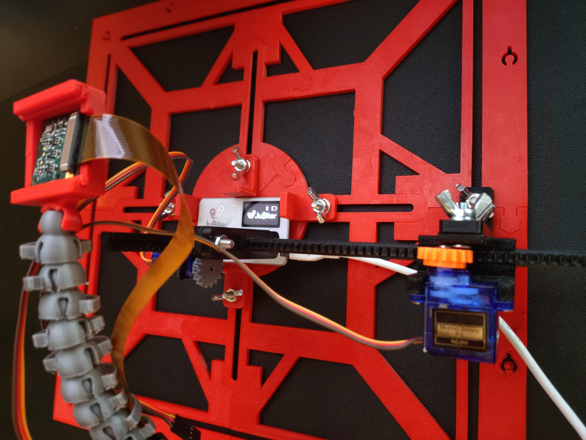
   
  <em>PRESSTO testing a hardware wallet</em>

## Features
- Automated physical interaction via Arduino-controlled servos
- OCR-based display capture

## Uses
- **Test physical inputs** – Consistently automate physical interaction like button presses or screen taps.  
- **Endurance testing** – Simulate hours or days of human interaction to reveal wear or intermittent faults.
- **Automated testing** – Fully automate operation of devices that can’t be driven purely by software, such as IoT appliances, hardware wallets etc.

## As seen in

[Large-Scale Security Analysis of Hardware Wallets](https://link.springer.com/chapter/10.1007/978-3-032-00633-2_21)

  

## Bill of Materials (BOM)

This project requires a combination of 3D-printed parts, electronics, and standard mechanical fasteners. Below is the complete list of components:

### Mechanical Components

| Part | Description | DIN Spec | Quantity |
|------|-------------|----------|----------|
| M4 Hex Nuts | Standard M4 nuts for fastening | DIN 934 | Variable |
| M4 Machine Screws | M4 × 16 mm flat-head screws | DIN 965 | Variable |
| M4 Wing Nuts | Tool-free tightening, used for adjustable parts | DIN 315 | Variable |
| M4 Washers | Standard washers for load distribution | DIN 125A | Variable |

> Most joints can be assembled using a mix of these fasteners. Quantities depend on your specific configuration (number of arms, modules, etc.).

### 3D-Printed Parts

- STL files are provided in the [`stl/`](stl/) directory for immediate use.
- Original Autodesk Inventor (`.ipt`) files are also included in the [`ipt/`](ipt/) directory, allowing for easy customization and adaptation to your specific hardware or setup needs.
- Recommended print settings:
  - Material: PLA or PETG
  - Layer Height: 0.15 mm
  - Infill: 15–30% for strength
  - Supports: As needed per part

### Electronics

| Component | Notes                                             | Quantity |
|----------|---------------------------------------------------|----------|
| Arduino Uno (or compatible) | For controlling servos                            | 1 |
| Raspberry Pi (any model with camera support) | For running OCR, camera capture, and automation scripts | 1 |
| SG90 Micro Servos | 2 per arm (e.g., one for press, one for movement) | ≥ 2 |
| Raspberry Pi Camera or USB Webcam | Used for OCR display capture                      | 1 |
| Power Supply | Depending on servo load                           | 1 |

> You can use a camera like the [Raspberry Pi Camera Module](https://www.raspberrypi.com/products/camera-module-3/), [Arducam](https://blog.arducam.com/raspberry-pi-multiple-cameras/) or any USB webcam.

## Assembly Instructions

<strong>Base</strong>

 

The <strong>base</strong> forms the main support structure of the setup. It consists of 8 interlocking 3D-printed parts that slot together like a puzzle to create a rigid square frame.

#### Required Parts

- 4 × [`base_inner.stl`](stl/base/base_inner.stl)
- 4 × [`base_outer.stl`](stl/base/base_outer.stl)

#### Assembly Steps

1. Arrange the 4 <strong>outer</strong> parts to form the perimeter of the square.
2. Position the 4 <strong>inner</strong> parts so they form a cross-bracing pattern.
3. Slot all pieces together using the integrated puzzle joints.
4. Ensure the central circular section interlocks firmly with no gaps.  
   - No screws or adhesives are required — the snap-fit design holds everything in place.

#### Visual Reference

| Description | Image |
|------------|--------|
| Individual STL preview – `base_inner` and `base_outer` |  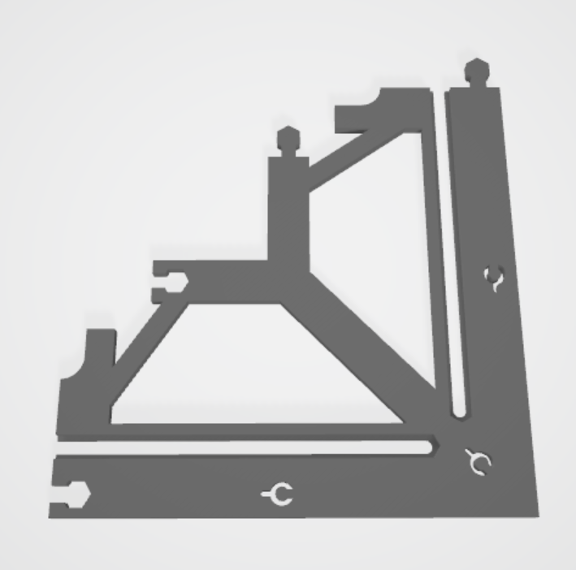 |
| Printed individual pieces laid out | 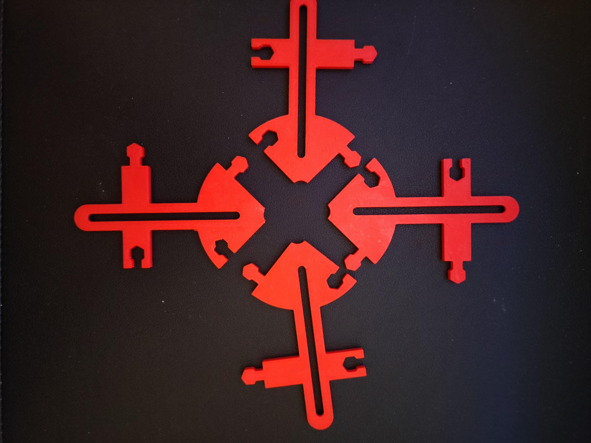 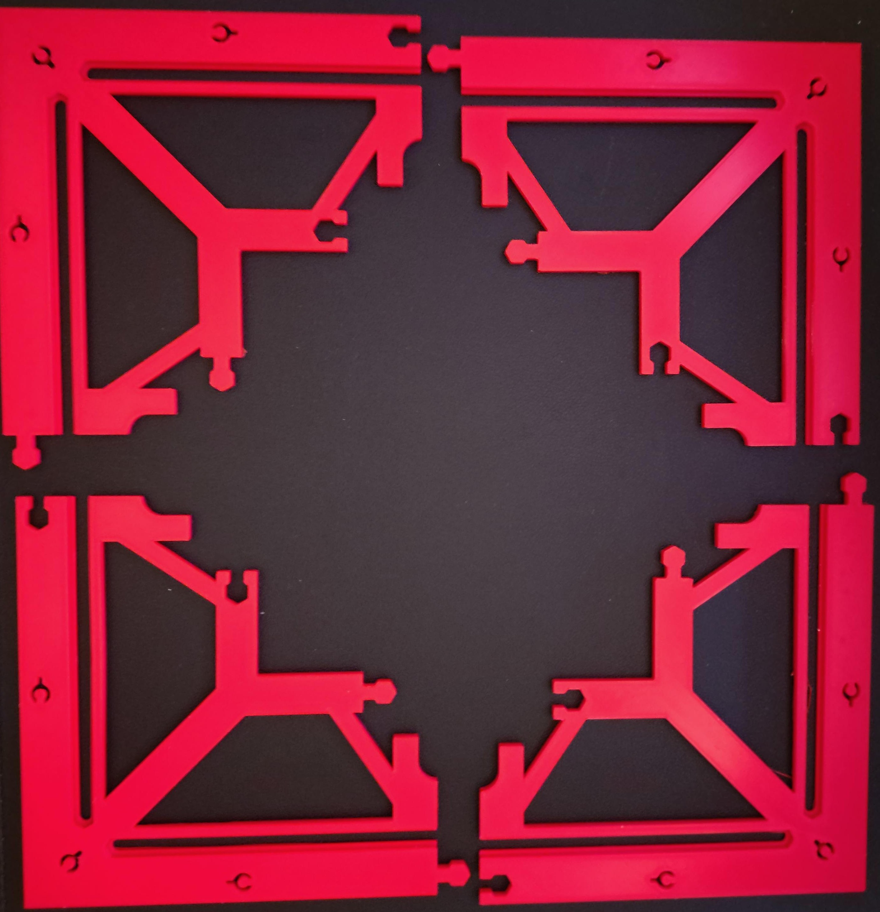 |
| Fully assembled base | 
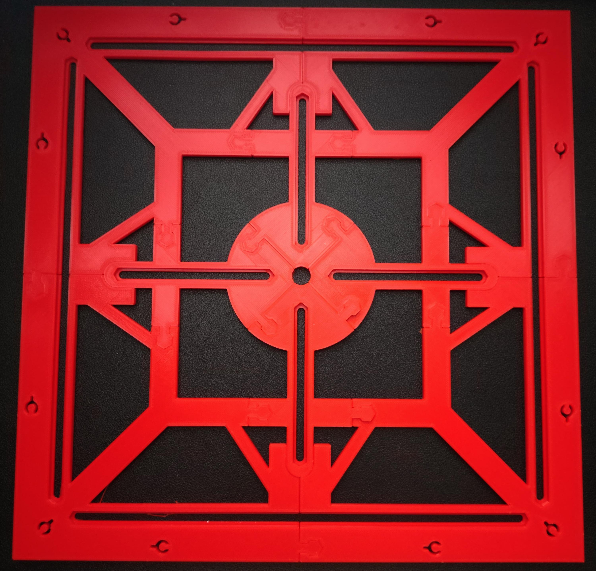
 |

<strong>Holder (Device Clamp)</strong>

 

The <strong>holder</strong> secures the device in place using a simple mechanical clamp. It is fastened through the radial slots on the base and tightened manually using M4 hardware.

#### Required Parts (per holder)

- 1 × [`holder.stl`](stl/holder/holder.stl)
- 1 × M4 × 16 mm screw (DIN 965)
- 1 × M4 washer (DIN 125A)
- 1 × M4 wing nut (DIN 315)

#### Assembly Steps

1. Insert the M4 screw <strong>from below</strong> through one of the radial slots in the base.
2. Place the 3D-printed holder part onto the protruding screw (on top of the base).
3. Add a washer on top of the holder.
4. Thread a wing nut onto the screw and hand-tighten it.
5. Adjust the position of the holder as needed so it presses against the edge of your device.
6. Tighten the wing nut to lock the holder in place.

#### Visual Reference

| Description               | Image                                                      |
|---------------------------|------------------------------------------------------------|
| STL preview of `holder`   | 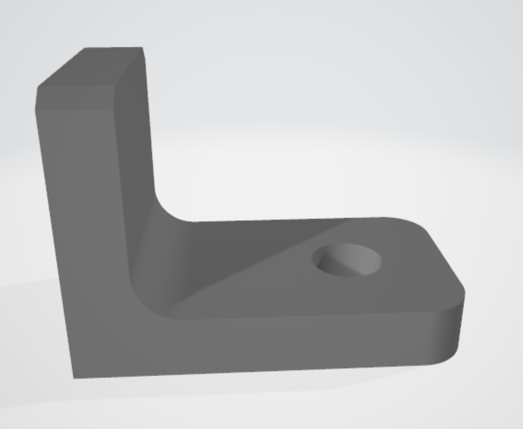 |
| Hardware + printed holder | 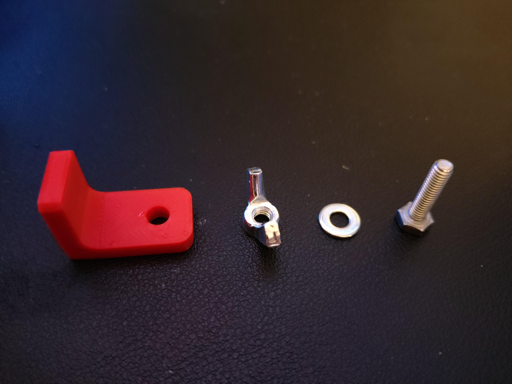        |
| Mounted holders           | 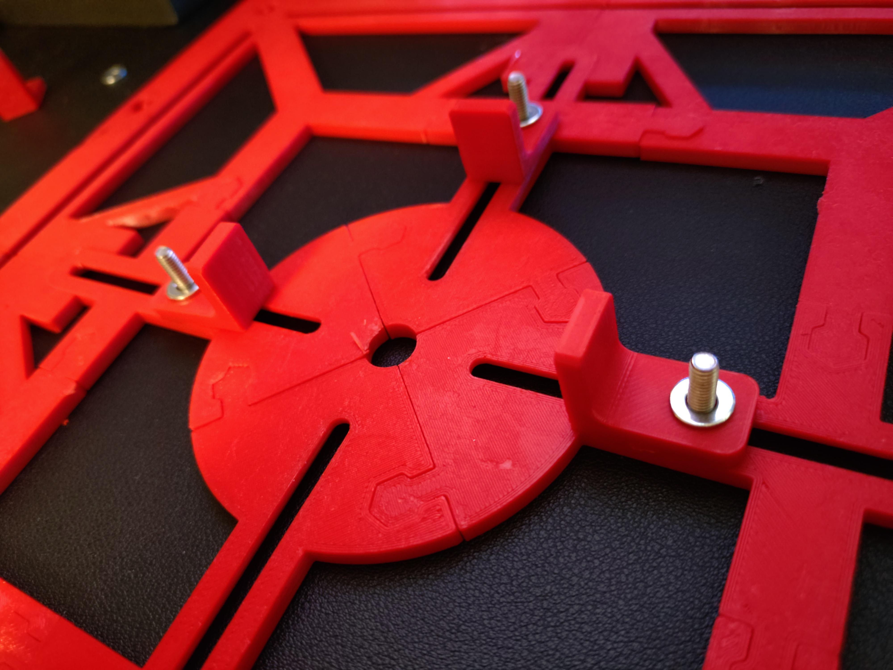 |
| Holders with a device     | 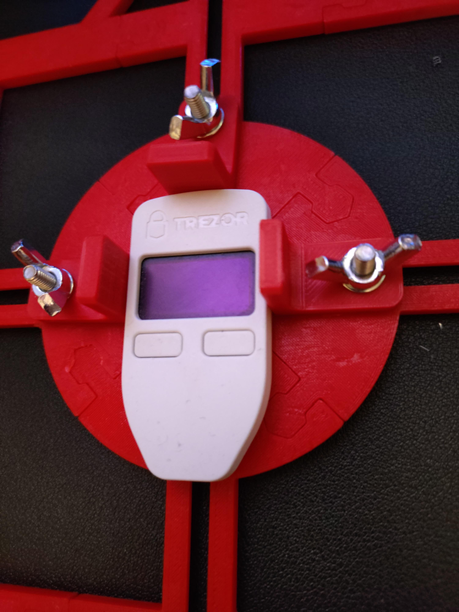 |

<strong>Camera Arm</strong>

 

The <strong>camera arm</strong> consists of three main components:
1. <strong>Arm Base</strong> – fits into the outer slots of the main base, no fasteners required.
2. <strong>Ball Joints</strong> – form the adjustable arm; hollow and designed with side hooks for cable management or threading smaller cables inside.
3. <strong>Camera Holder</strong> – attaches to the last ball joint to securely hold the camera.

#### Required Parts

- 1 × [`arm_base.stl`](stl/camera_arm/arm_base.stl)
- Multiple × [`ball_joint.stl`](stl/camera_arm/ball_joint.stl) (depending on desired arm length)
- 1 × [`camera_holder.stl`](stl/camera_arm/camera_holder.stl)

#### Assembly Steps

1. Insert the <strong>arm base</strong> into one of the outer slots of the main base.
2. Connect <strong>ball joints</strong> together until you reach the desired arm length.  
   - Ball joints can be rotated to adjust the arm angle.  
   - Use the built-in hooks or hollow core for cable routing.
3. Attach the <strong>camera holder</strong> to the last ball joint.
4. Mount the camera into the holder.
5. Adjust the arm’s position and angles as needed for optimal camera view.

#### Visual Reference

| Description | Image |
|------------|-------|
| Arm base (STL preview) | 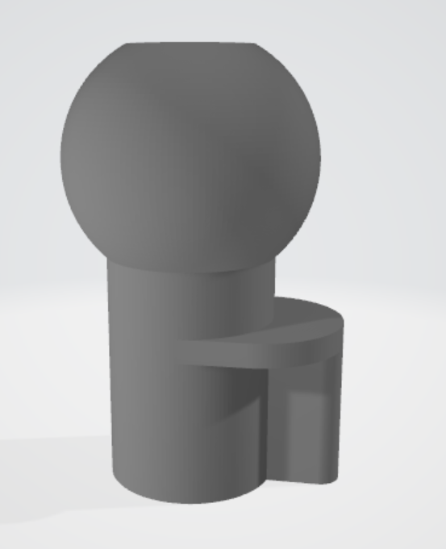 |
| Ball joint (STL preview) | 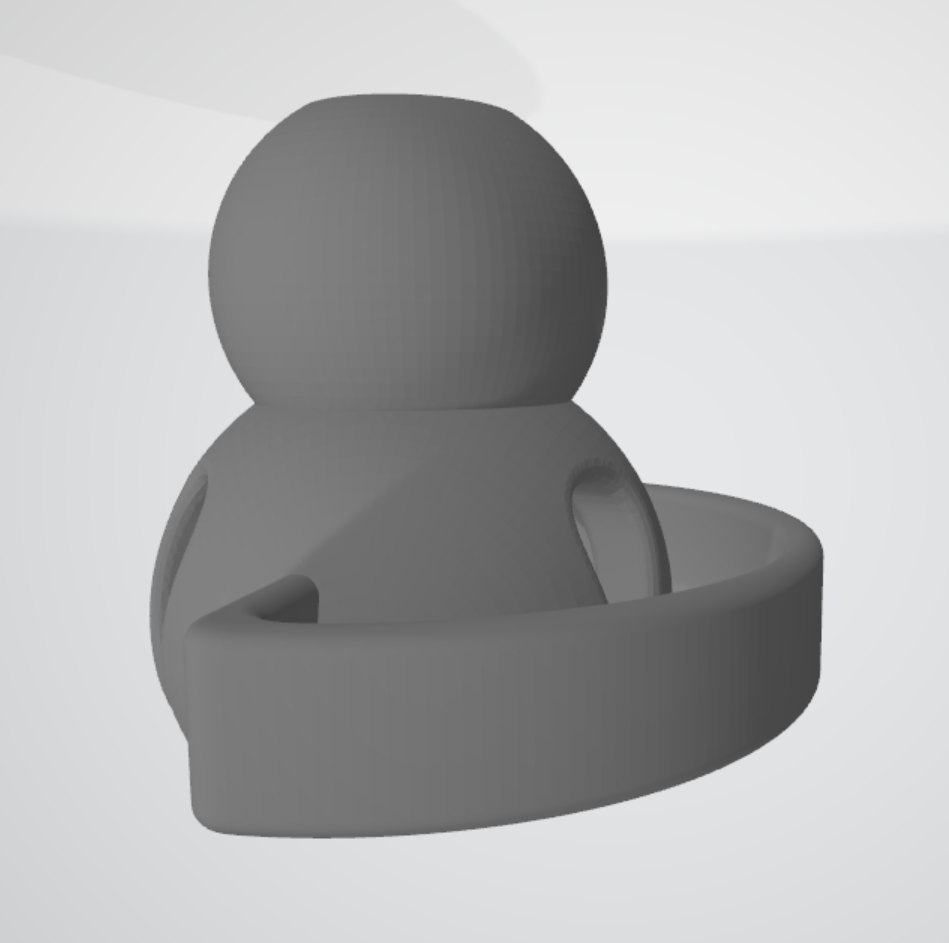 |
| Camera holder (STL preview) |  |
| Printed camera arm components | 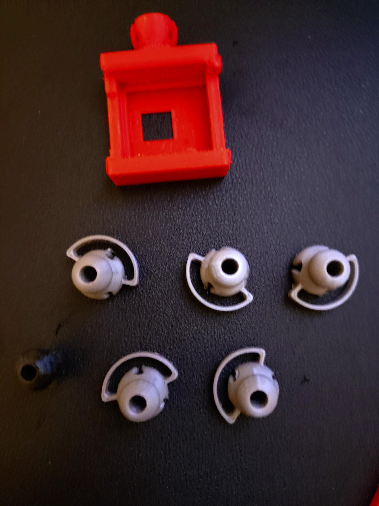 |
| Fully assembled camera arm | 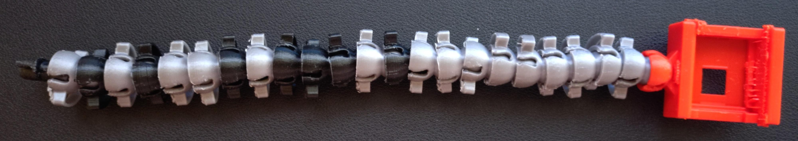 |

<strong>Actuator Arm – Pinion Gear</strong>

 

The <strong>pinion gear</strong> connects directly to the SG90 servo’s output shaft. It is used to transfer rotational motion from the servo to other moving parts in the actuator assembly.

#### Required Parts

- 1 × [`pinion_gear.stl`](stl/pinion_gear/pinion_gear.stl)
- 1 × SG90 servo motor
- 1 × Servo mounting screw (comes with SG90)

#### Assembly Steps

1. Place the printed <strong>pinion gear</strong> onto the output shaft of the SG90 servo.
2. Align the gear so that it sits flush against the servo horn mount.
3. Secure the gear using the small screw provided with the SG90 servo.

#### Visual Reference

| Description | Image |
|------------|-------|
| STL preview – `pinion_gear` |  |
| Printed gear + SG90 servo | 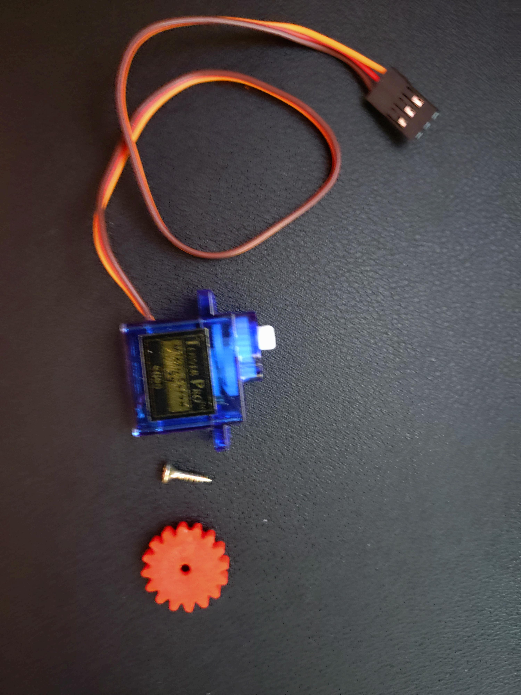 |

<strong>Actuator Arm Base</strong>

 

The Actuator Arm Base moves the actuator over the device and retracts it to give the camera an unobstructed view.

#### Required Parts

- 1 × [`pinion_gear.stl`](stl/pinion_gear/pinion_gear.stl) — attached to the SG90 servo output shaft  
- 1 × SG90 micro servo (with 2 × mounting screws supplied with the servo)  
- 1 × [`actuator_arm_motor_holder.stl`](stl/actuator_arm_base/actuator_arm_motor_holder.stl) — to secure the servo  
- 1 × [`actuator_arm_base_rack.stl`](stl/actuator_arm_base/actuator_arm_base_rack.stl) — for linear motion  
- 1 × [`actuator_arm_base_stand.stl`](stl/actuator_arm_base/actuator_arm_base_stand.stl) — to mount the assembly to the base  
- 2 × M4 × 16 mm machine screws (DIN 965)  
- 2 × M4 washers (DIN 125A)  
- 2 × M4 wing nuts (DIN 315) — to attach motor holder to the stand  
- 1 × M4 × 16 mm machine screw (DIN 965)  
- 1 × M4 washer (DIN 125A)  
- 1 × M4 wing nut (DIN 315) — to mount the stand to the base

#### Assembly Notes

- The SG90 servo is fixed into the <strong>motor holder</strong> using the two screws supplied with the SG90.  
- The <strong>stand</strong> mounts to the <strong>outer base slot</strong> in the same way as the device holder — using an M4 screw, washer, and wing nut from below.  
- The <strong>motor holder</strong> attaches to the stand at the desired height using two M4 screws, washers, and wing nuts.  
  - If space is tight (for example, with multiple arms close together), a regular M4 machine screw with a hex nut (DIN 934) may be used instead of the wing nut on one side.  
- For <strong>easier assembly</strong>, insert at least the inside M4 screw into the motor holder <strong>before</strong> inserting the rack — otherwise, it will be blocked.

**Recommended assembly sequence**  
1. Insert the inside M4 screw into the motor holder.  
2. Slide in the rack.  
3. Attach the SG90 servo with the pinion gear already mounted, using its supplied screws.  
4. Insert the remaining M4 screw.  
5. Attach the motor holder to the stand with the two M4 screws, washers, and wing nuts.  
6. Mount the stand to the base.

#### Visual Reference

| Description | Image |
|-------------|-------|
| Individual STL preview – `actuator_arm_motor_holder`, `actuator_arm_base_rack`, `actuator_arm_base_stand` | 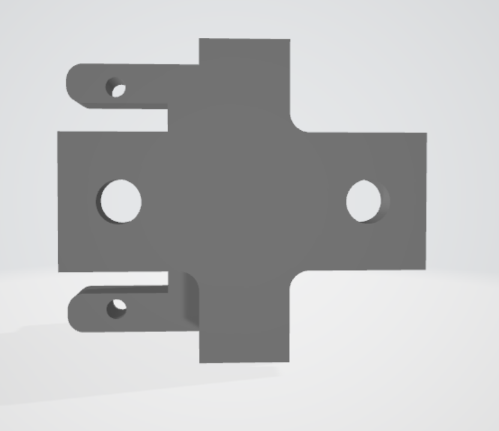 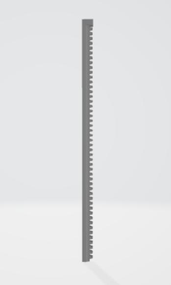 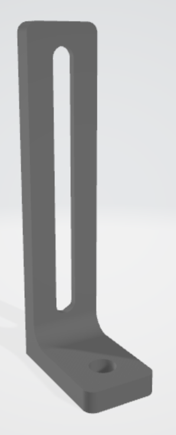 |
| SG90 with attached `pinion_gear` and motor holder parts | 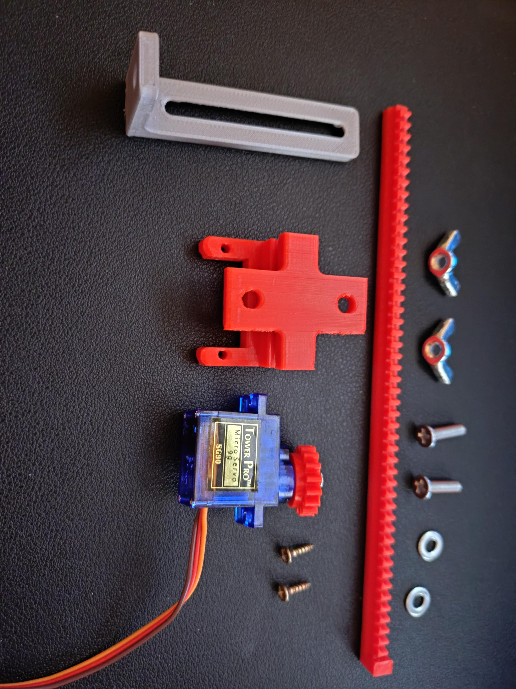 |
| Partially assembled with rack and servo in place | 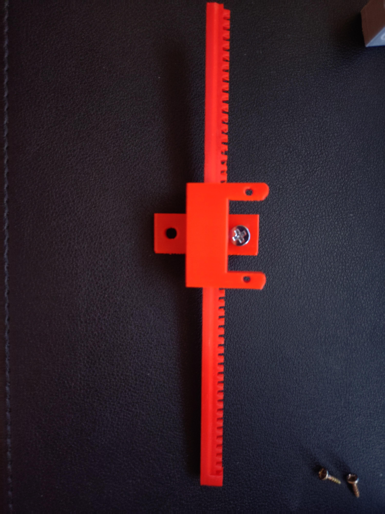 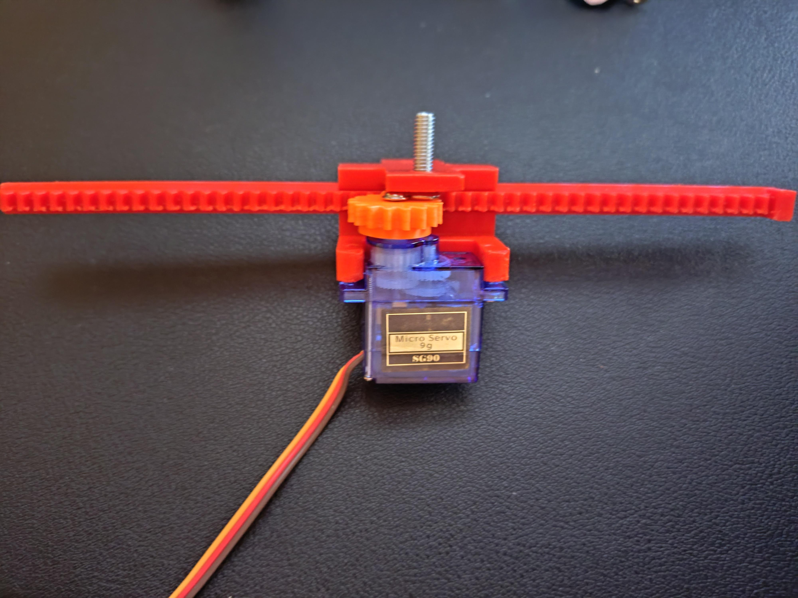 |
| Mounted on stand, ready to attach to base | 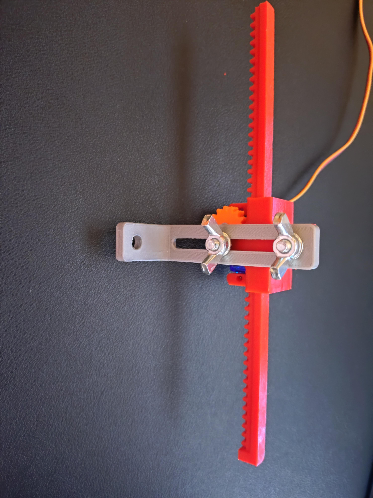 |

<strong>Actuator Arm</strong>

 

The actuator arm is the moving element that pushes buttons or touches a screen.  
It connects directly to the [`actuator_arm_base_rack.stl`](stl/actuator_arm_base/actuator_arm_base_rack.stl) and is driven by an SG90 servo with the [`pinion_gear.stl`](stl/pinion_gear/pinion_gear.stl) attached.

### Required Parts

- 1 × [`pinion_gear.stl`](stl/pinion_gear/pinion_gear.stl) — attached to the SG90 servo output shaft  
- 1 × SG90 micro servo (with 2 × mounting screws supplied with the servo)  
- 1 × [`actuator_arm_motor_holder_mount.stl`](stl/actuator_arm/actuator_arm_motor_holder_mount.stl) — bracket to secure the servo  
- 1 × [`actuator_arm_rack.stl`](stl/actuator_arm/actuator_arm_rack.stl) <em>or</em> [`actuator_arm_rack_wide.stl`](stl/actuator_arm/actuator_arm_rack_wide.stl) — for linear motion  
- 1 × [`actuator_arm_motor_holder.stl`](stl/actuator_arm/actuator_arm_motor_holder.stl) — attaches to the rack and connects to the base  
- 2 × M4 × 16 mm machine screws (DIN 965)  
- 2 × M4 washers (DIN 125A)  
- 2 × M4 hex nuts (DIN 934) — to attach the motor holder to the mount  
- Optional: counterweight bracket (BOM screws, washers, nuts)  
- Optional: stylus tip for touchscreens

### Assembly Steps

1. <strong>Attach the bracket</strong> ([`actuator_arm_motor_holder_mount.stl`](stl/actuator_arm/actuator_arm_motor_holder_mount.stl)) to the motor holder using 2 × M4 machine screws with washers and hex nuts.
2. <strong>Insert the rack</strong> ([`actuator_arm_rack.stl`](stl/actuator_arm/actuator_arm_rack.stl) or [`actuator_arm_rack_wide.stl`](stl/actuator_arm/actuator_arm_rack_wide.stl)) into the motor holder.
3. <strong>Install the SG90 servo</strong>: attach the [`pinion_gear.stl`](stl/pinion_gear/pinion_gear.stl) to the servo output shaft, align with the rack teeth, and fasten the servo using the 2 screws supplied with the SG90.
4. <strong>Optional</strong> – add a counterweight bracket on the opposite side of the base rack to balance longer racks.

### Visual Reference

| Description | Image |
|-------------|-------|
| Individual STL previews – `actuator_arm_motor_holder_mount.stl`, `actuator_arm_motor_holder.stl`, `actuator_arm_rack.stl`, `actuator_arm_rack_wide.stl` |  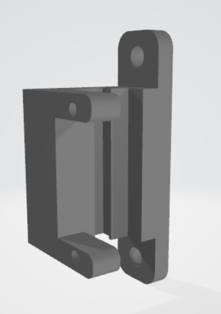 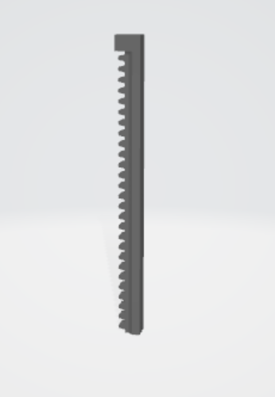  |
| Actuator arm assembly | 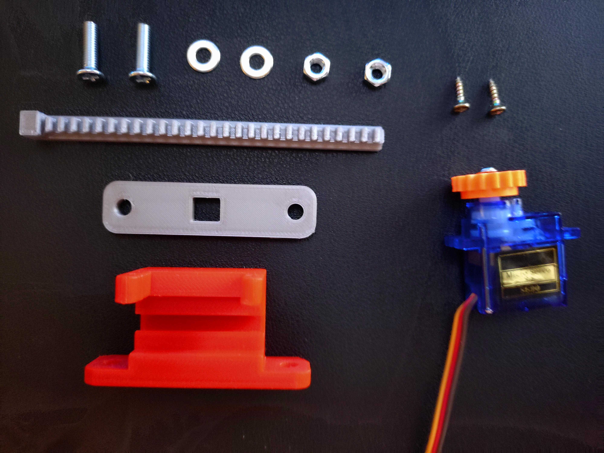 |
| Mounted actuator arm (view 1) | 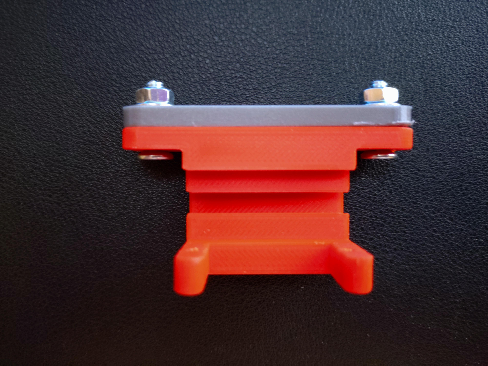 |
| Mounted actuator arm (view 2) | 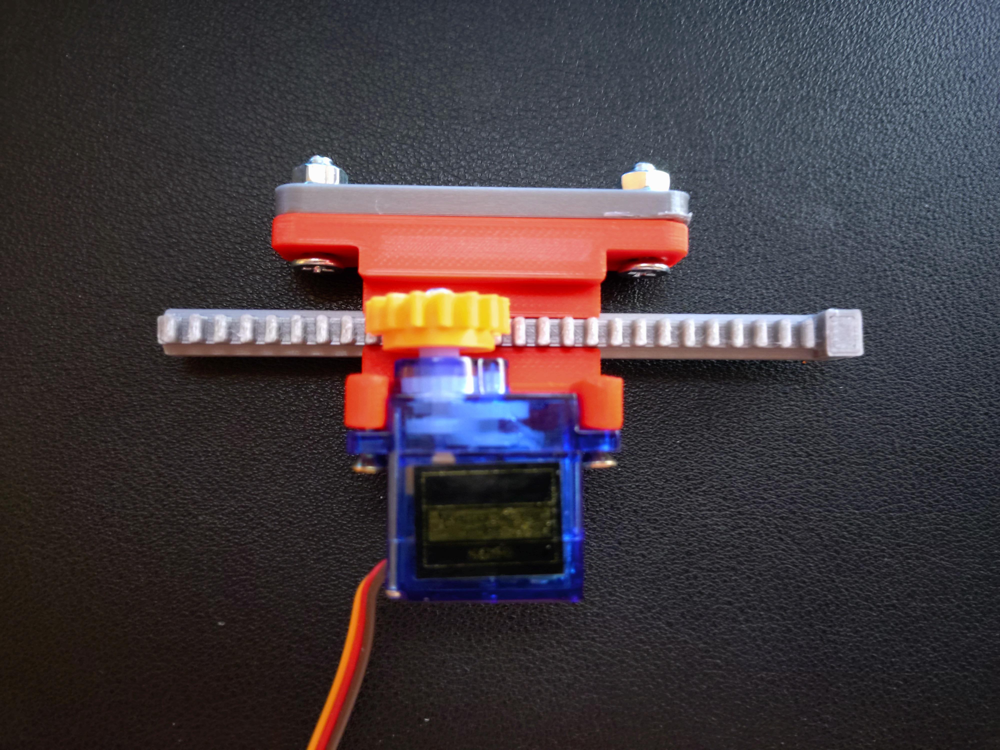 |

### Connecting the Actuator Arm to the Base

No screws are needed for this step – simply slide the [`actuator_arm_base_rack.stl`](stl/actuator_arm_base/actuator_arm_base_rack.stl) into the [`actuator_arm_motor_holder.stl`](stl/actuator_arm/actuator_arm_motor_holder.stl) mount hole until it seats fully.

| Step | Image |
|------|-------|
| Align the base rack with the actuator arm mount hole | 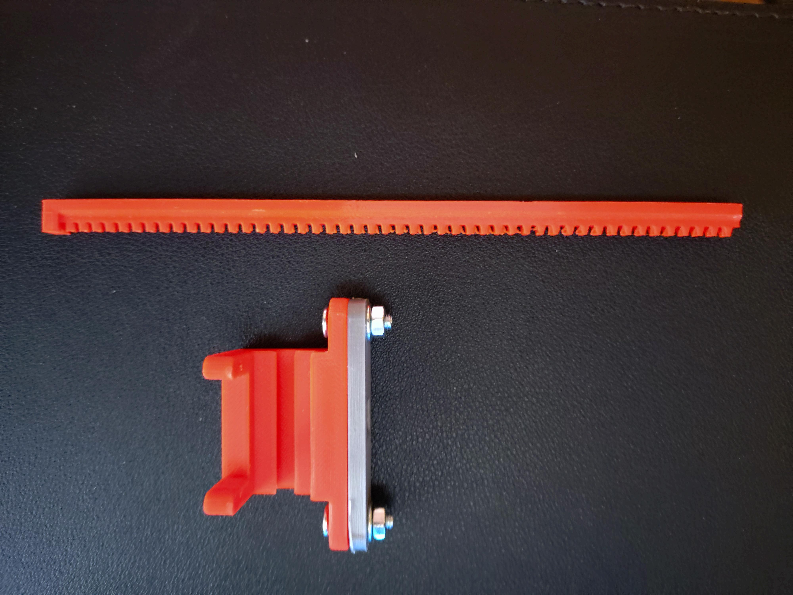 |
| Slide until seated fully | 
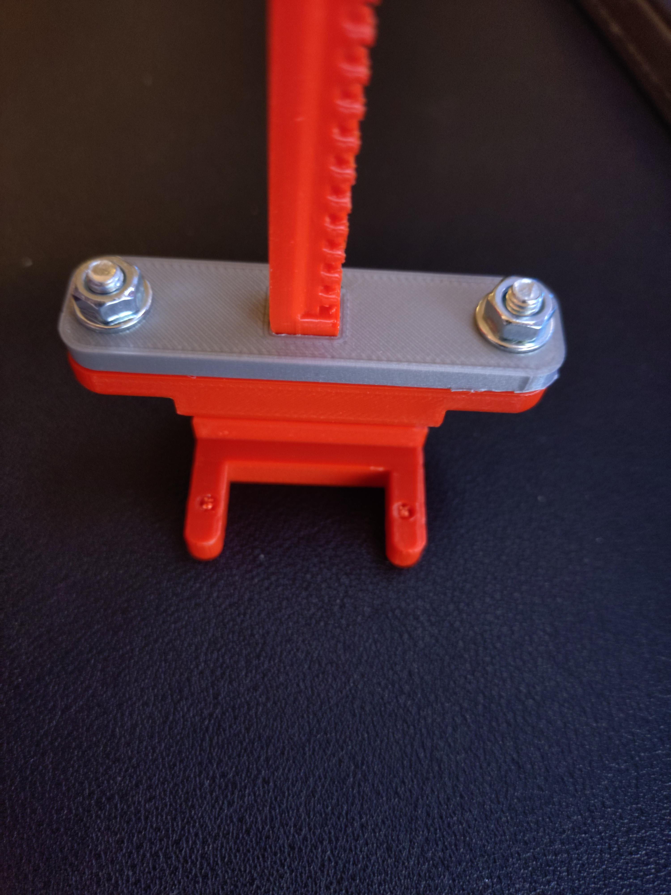
 |

