# PRESSTO
Physical Response Emulation System for Secure Testing Operations is a low-cost, fully automated, and reproducible hardware analysis platform. It enables precise and repeatable testing of devices by simulating human interaction such as button presses and screen reading without compromising cryptographic security assumptions.

**Known limits of v1** (observed on the hardware): at full reach an arm can bend, so the servo pushes the arm away instead of pressing the button; and v1 uses the SG90 in both of its versions, the 180° one and the continuous-rotation one, and the continuous-rotation servos are hard to calibrate.

<p align="center">
  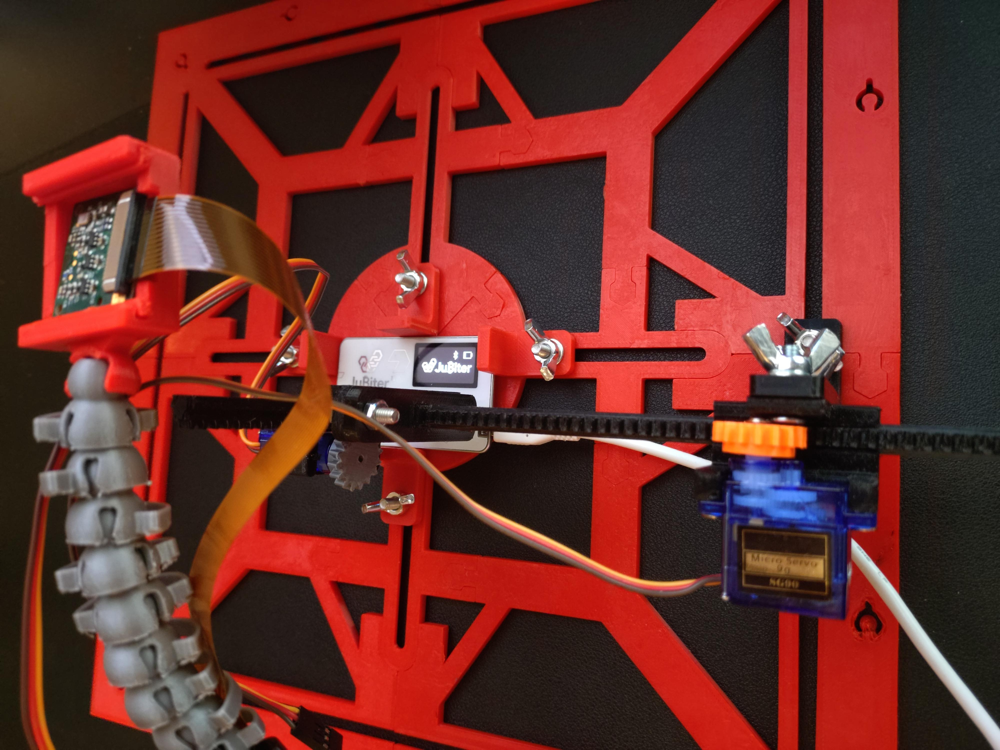
  <br>
  <em>PRESSTO testing a hardware wallet</em>
</p>


## Features
- Automated physical interaction via Arduino-controlled servos
- OCR-based display capture

## Uses
- **Test physical inputs** – Consistently automate physical interaction like button presses or screen taps.  
- **Endurance testing** – Simulate hours or days of human interaction to reveal wear or intermittent faults.
- **Automated testing** – Fully automate operation of devices that can’t be driven purely by software, such as IoT appliances, hardware wallets etc.

## Where PRESSTO has been used

PRESSTO v1 was used for the study below, a large-scale security analysis of hardware wallets; so far it is PRESSTO's only published use, and this section will list further uses as they come. To cite PRESSTO, please cite this paper; its BibTeX entry follows.

[Large-Scale Security Analysis of Hardware Wallets](https://link.springer.com/chapter/10.1007/978-3-032-00633-2_21)

```bibtex
@inbook{Sorf_2025,
  title={Large-Scale Security Analysis of Hardware Wallets},
  ISBN={9783032006332},
  ISSN={1611-3349},
  url={http://dx.doi.org/10.1007/978-3-032-00633-2_21},
  DOI={10.1007/978-3-032-00633-2_21},
  booktitle={Availability, Reliability and Security},
  publisher={Springer Nature Switzerland},
  author={Šorf, Milan and Švenda, Petr and Chmielewski, Łukasz},
  year={2025},
  pages={360–377}
}
```

  

## Quickstart
Download the full set of models for one PRESSTO instance + printing instructions: [`quickstart.zip`](https://github.com/crocs-muni/pressto/releases/download/v1.0/quickstart.zip) (5.7 MB). The print list is also in [`stl/print.txt`](stl/print.txt).


## Bill of Materials (BOM)

This project requires a combination of 3D-printed parts, electronics, and standard mechanical fasteners. Below is the complete list of components:

### Mechanical Components

| Part | Description | DIN Spec | Quantity |
|------|-------------|----------|----------|
| M4 Hex Nuts | Standard M4 nuts for fastening | DIN 934 | Variable |
| M4 Machine Screws | M4 × 16 mm flat-head screws | DIN 965 | Variable |
| M4 Wing Nuts | Tool-free tightening, used for adjustable parts | DIN 315 | Variable |
| M4 Washers | Standard washers for load distribution | DIN 125A | Variable |

> Most joints can be assembled using a mix of these fasteners. Quantities depend on your specific configuration (number of arms, modules, etc.).

### 3D-Printed Parts

- STL files are provided in the [`stl/`](stl/) directory for immediate use.
- Original Autodesk Inventor (`.ipt`) files are also included in the [`ipt/`](ipt/) directory, allowing for easy customization and adaptation to your specific hardware or setup needs.
- Recommended print settings:
  - Material: PLA or PETG
  - Layer Height: 0.15 mm
  - Infill: 15–30% for strength
  - Supports: As needed per part
- The largest parts, measured in their STL files: `base_outer`, about 146 × 158 mm and 4 mm thick, and the racks, up to 165 mm long.

### Electronics

| Component | Notes                                             | Quantity |
|----------|---------------------------------------------------|----------|
| Arduino Uno (or compatible) | For controlling servos                            | 1 |
| Raspberry Pi (any model with camera support) | For running OCR, camera capture, and automation scripts | 1 |
| SG90 Micro Servos | 2 per arm (e.g., one for press, one for movement) | ≥ 2 |
| Raspberry Pi Camera or USB Webcam | Used for OCR display capture                      | 1 |
| Power Supply | Depending on servo load                           | 1 |
| Display, keyboard and mouse (or remote access) | For the Raspberry Pi                               | — |
| USB cable | From the Arduino to the Raspberry Pi               | — |
| Raspberry Pi power supply | For the Raspberry Pi (the Power Supply above is for the servos) | — |
| microSD card | For the Raspberry Pi                               | — |
| Camera cable | From the camera to the Raspberry Pi                | — |
| Jumper wires | For the servo signal, power and ground connections | — |
| Breadboard | For the servo power and the common ground          | — |
| Stylus tip (optional) | For touchscreens, grounded through a Dupont wire   | — |

> The Arduino plugs into the Raspberry Pi, which drives the operation.

> Which Raspberry Pi to use depends on the use case: whether the images are processed on the Pi in real time, or only collected and sent to a stronger machine. PRESSTO v1 was tested on the Raspberry Pi Zero, 3, 4 and 5.

> "SG90" servos from one batch can be different makes, whose body dimensions differ. The holders fit both makes we measured, but cheap clones may differ, so stick with one type of servo.


> You can use a camera like the [Raspberry Pi Camera Module](https://www.raspberrypi.com/products/camera-module-3/), [Arducam](https://blog.arducam.com/raspberry-pi-multiple-cameras/) or any USB webcam (no mount is provided for a USB webcam).

### Tools

- Screwdrivers
- A spanner
- Side cutters (for the servo horn)

## Assembly Instructions

<details>
<summary><strong>Base</strong></summary>

<br>

The <strong>base</strong> forms the main support structure of the setup. It consists of 8 interlocking 3D-printed parts that slot together like a puzzle to create a rigid square frame.

### Required Parts

- 4 × [`base_inner.stl`](stl/base/base_inner.stl)
- 4 × [`base_outer.stl`](stl/base/base_outer.stl)

### Assembly Steps

1. Arrange the 4 <strong>outer</strong> parts to form the perimeter of the square.
2. Position the 4 <strong>inner</strong> parts so they form a cross-bracing pattern.
3. Slot all pieces together using the integrated puzzle joints.
4. Ensure the central circular section interlocks firmly with no gaps.  
   - No screws or adhesives are required — the snap-fit design holds everything in place.

### Visual Reference

| Description | Image |
|------------|--------|
| Individual STL previews – `base_inner`, `base_outer` | 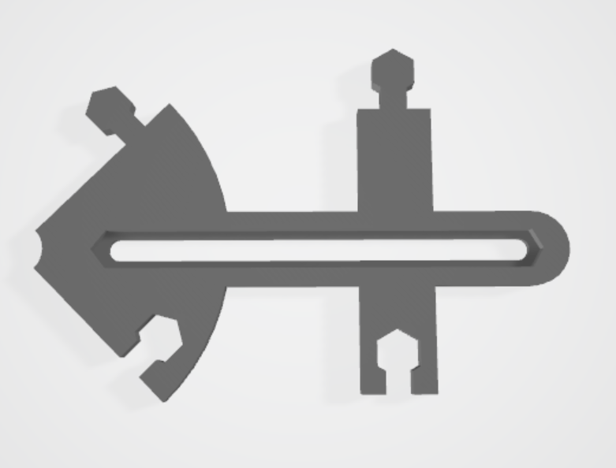 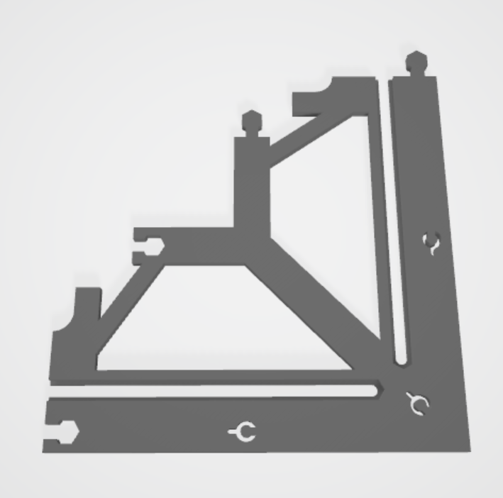 |
| Printed individual pieces laid out | 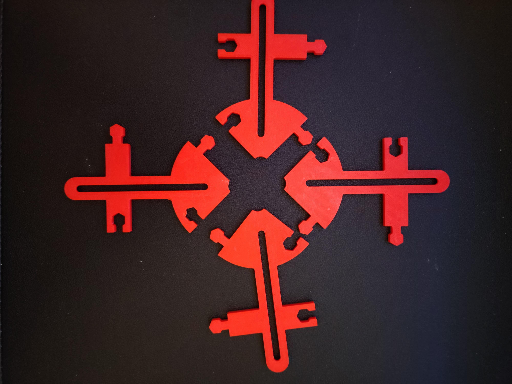 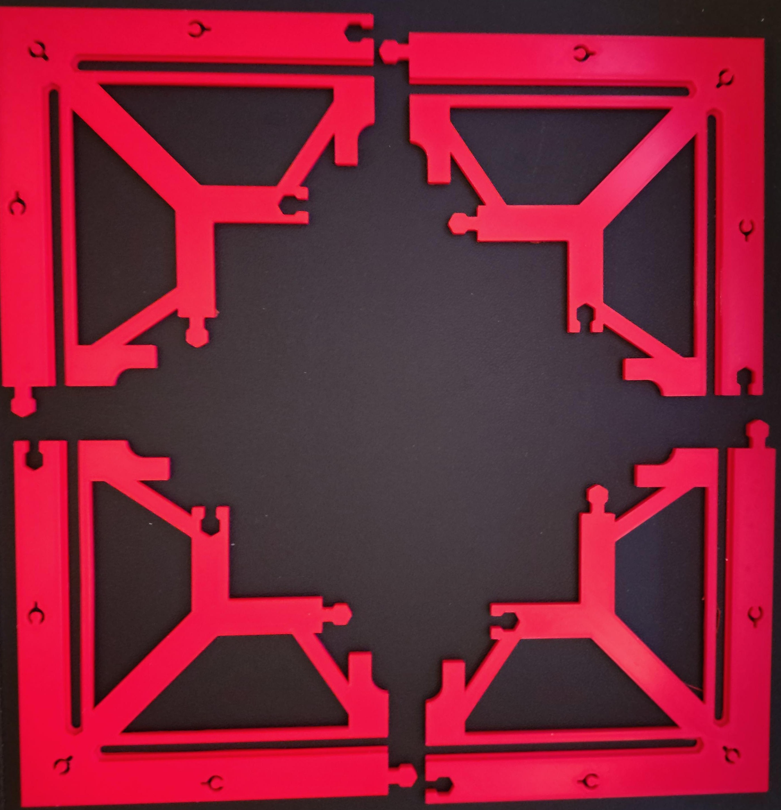 |
| Fully assembled base | <div align="center">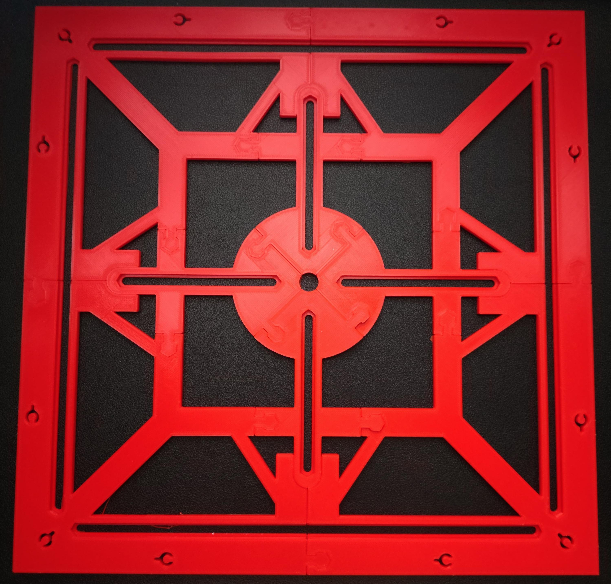</div> |

</details>

<details>
<summary><strong>Holder (Device Clamp)</strong></summary>

<br>

The <strong>holder</strong> secures the device in place using a simple mechanical clamp. It is fastened through the radial slots on the base and tightened manually using M4 hardware.

### Required Parts (per holder)

- 1 × [`holder.stl`](stl/holder/holder.stl)
- 1 × M4 × 16 mm screw (DIN 965)
- 1 × M4 washer (DIN 125A)
- 1 × M4 wing nut (DIN 315)

### Assembly Steps

1. Insert the M4 screw <strong>from below</strong> through one of the radial slots in the base.
2. Place the 3D-printed holder part onto the protruding screw (on top of the base).
3. Add a washer on top of the holder.
4. Thread a wing nut onto the screw and hand-tighten it.
5. Adjust the position of the holder as needed so it presses against the edge of your device.
6. Tighten the wing nut to lock the holder in place.

The M4 screw heads sit in a slot under the base, so the base does not rock.

### Visual Reference

| Description               | Image                                                      |
|---------------------------|------------------------------------------------------------|
| STL preview – `holder`    | 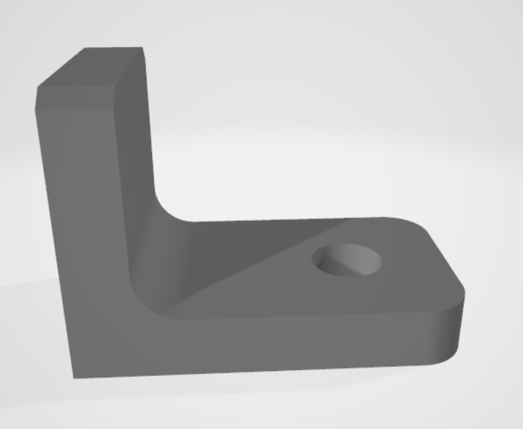 |
| Hardware + printed holder | 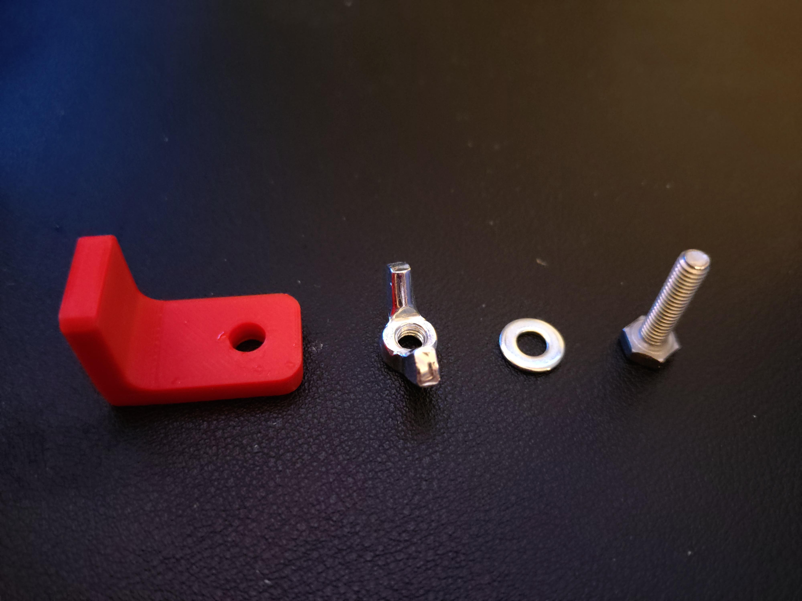        |
| Mounted holders           | 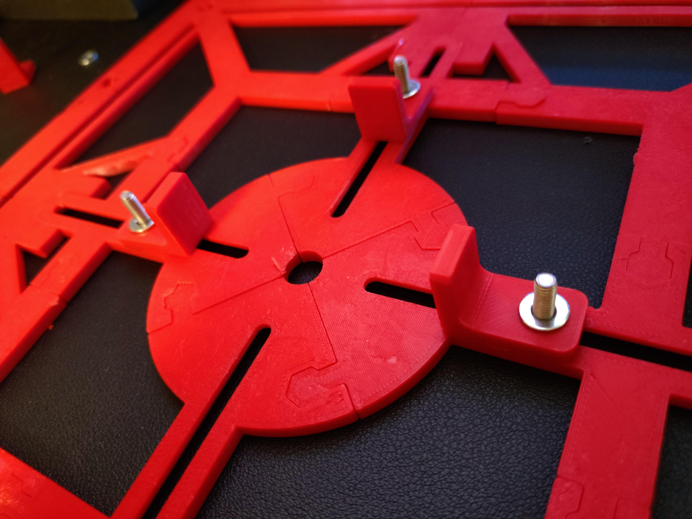 |
| Holders with a device     | 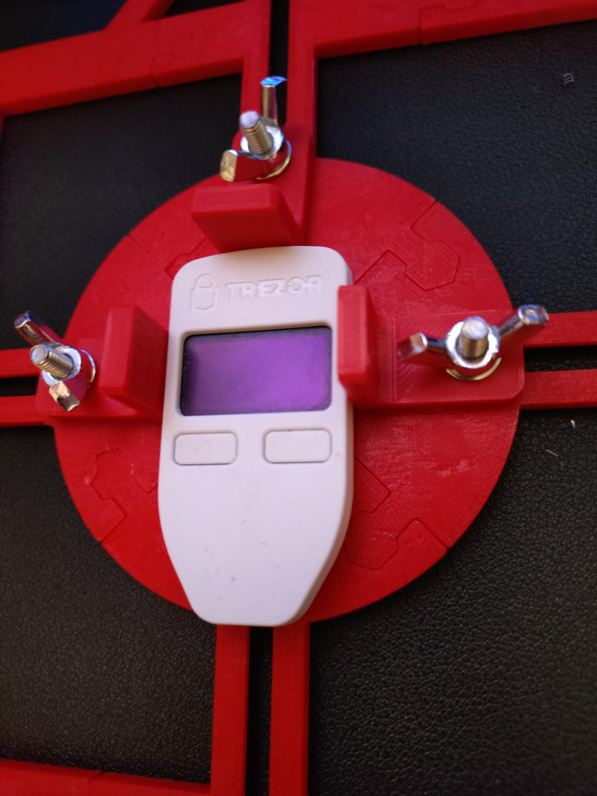 |

</details>

<details>
<summary><strong>Camera Arm</strong></summary>

<br>

The <strong>camera arm</strong> consists of three main components:
1. <strong>Arm Base</strong> – fits into the outer slots of the main base, no fasteners required.
2. <strong>Ball Joints</strong> – form the adjustable arm; hollow and designed with side hooks for cable management or threading smaller cables inside.
3. <strong>Camera Holder</strong> – attaches to the last ball joint to securely hold the camera; it fits the Raspberry Pi camera modules and Arducam cameras, which share one board format.

### Required Parts

- 1 × [`arm_base.stl`](stl/camera_arm/arm_base.stl)
- Multiple × [`ball_joint.stl`](stl/camera_arm/ball_joint.stl) (depending on desired arm length)
- 1 × [`camera_holder.stl`](stl/camera_arm/camera_holder.stl)

### Assembly Steps

1. Insert the <strong>arm base</strong> into one of the outer slots of the main base: its keyed stem goes into one of the round keyhole sockets of the outer parts (three in each `base_outer`), not into one of the slots for M4 screws (those take the screws of the device holders and of the stand).
2. Connect <strong>ball joints</strong> together until you reach the desired arm length.  
   - Ball joints can be rotated to adjust the arm angle.  
   - Use the built-in hooks or hollow core for cable routing.
3. Attach the <strong>camera holder</strong> to the last ball joint.
4. Mount the camera into the holder.
5. Adjust the arm’s position and angles as needed for optimal camera view.

### Visual Reference

| Description | Image |
|------------|-------|
| STL preview – `arm_base` | 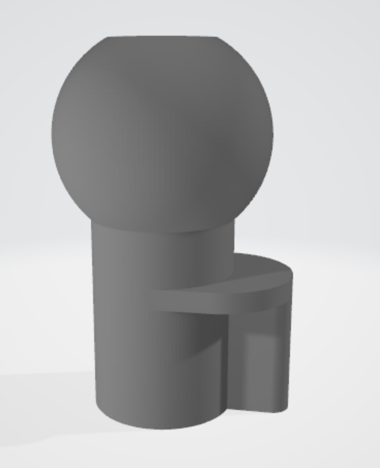 |
| STL preview – `ball_joint` | 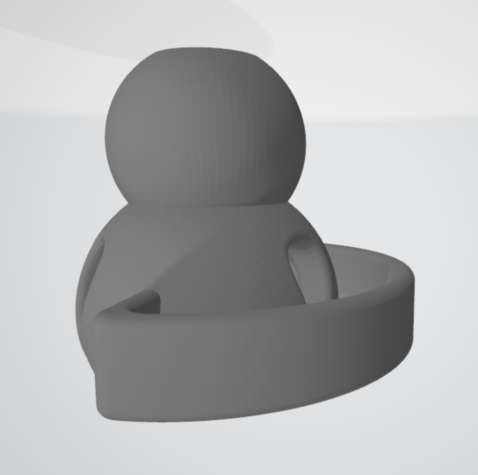 |
| STL preview – `camera_holder` | 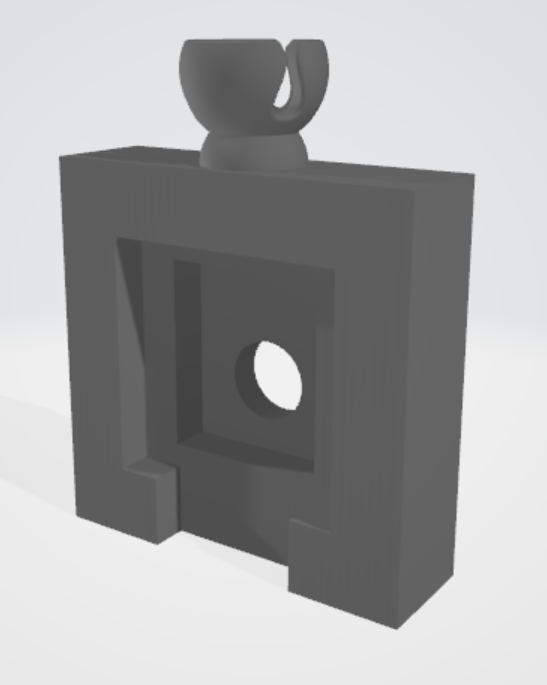 |
| Printed camera arm components | 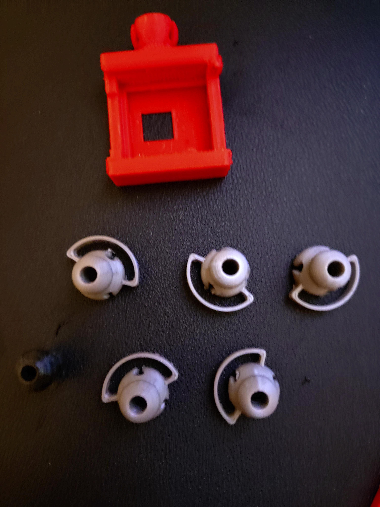 |
| Fully assembled camera arm | 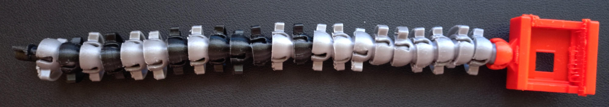 |

The photos show an earlier print with a square lens opening; the published CAD has a round one. Both fit, and the CAD is the reference.

</details>

<details>
<summary><strong>Actuator Arm – Pinion Gear</strong></summary>

<br>

The <strong>pinion gear</strong> connects to the SG90 servo’s output shaft through the hub of a cut-down servo horn. It is used to transfer rotational motion from the servo to other moving parts in the actuator assembly.

A full arm uses two pinions: one for the press, one for moving the pressing part back and forth.

The pinion caps over the hub of a stock SG90 horn cut free of its arms; the horn screw clamps it through the pinion's centre hole.

### Required Parts

- 1 × [`pinion_gear.stl`](stl/pinion_gear/pinion_gear.stl)
- 1 × SG90 servo motor
- 1 × stock SG90 horn, cut free of its arms (only its hub is used)
- 1 × Servo mounting screw (comes with SG90)

### Assembly Steps

1. Cap the printed <strong>pinion gear</strong> over the hub of a cut-down SG90 horn (the hub goes into the round socket in one face of the pinion; that face points to the servo), and seat the hub on the output shaft of the SG90 servo.
2. Align the gear so that it sits flush against the servo horn mount.
3. Secure the gear using the small screw provided with the SG90 servo.

### Visual Reference

| Description | Image |
|------------|-------|
| STL preview – `pinion_gear` |  |
| Printed gear + SG90 servo | 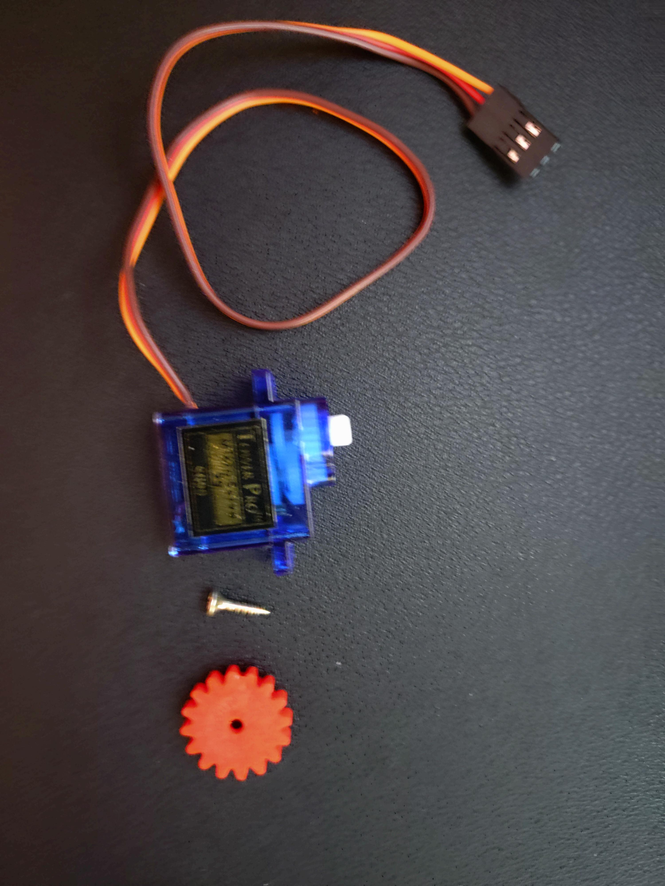 |

</details>

<details>
<summary><strong>Actuator Arm Base</strong></summary>

<br>

The Actuator Arm Base moves the actuator over the device and retracts it to give the camera an unobstructed view.

### Required Parts

- 1 × [`pinion_gear.stl`](stl/pinion_gear/pinion_gear.stl) — attached to the SG90 servo output shaft through the hub of a cut-down horn  
- 1 × SG90 micro servo (with 2 × mounting screws supplied with the servo)  
- 1 × [`actuator_arm_base_motor_holder.stl`](stl/actuator_arm_base/actuator_arm_base_motor_holder.stl) <em>or</em>, for easier installation, [`actuator_arm_base_motor_holder_single_hole.stl`](stl/actuator_arm_base/actuator_arm_base_motor_holder_single_hole.stl) — to secure the servo  
- 1 × [`actuator_arm_base_rack.stl`](stl/actuator_arm_base/actuator_arm_base_rack.stl) <em>or</em> [`actuator_arm_base_rack_with_mount.stl`](stl/actuator_arm_base/actuator_arm_base_rack_with_mount.stl) — for linear motion  
- 1 × [`actuator_arm_base_stand.stl`](stl/actuator_arm_base/actuator_arm_base_stand.stl) — to mount the assembly to the base  
- 2 × M4 × 16 mm machine screws (DIN 965)  
- 2 × M4 washers (DIN 125A)  
- 2 × M4 wing nuts (DIN 315) — to attach motor holder to the stand  
- 1 × M4 × 16 mm machine screw (DIN 965)  
- 1 × M4 washer (DIN 125A)  
- 1 × M4 wing nut (DIN 315) — to mount the stand to the base

### Assembly Notes

- The SG90 servo is fixed into the <strong>motor holder</strong> using the two screws supplied with the SG90.  
- The <strong>stand</strong> mounts to the <strong>outer base slot</strong> in the same way as the device holder — using an M4 screw, washer, and wing nut from below.  
- The <strong>motor holder</strong> attaches to the stand at the desired height using two M4 screws, washers, and wing nuts.  
  - If space is tight (for example, with multiple arms close together), a regular M4 machine screw with a hex nut (DIN 934) may be used instead of the wing nut on one side.  
- For <strong>easier assembly</strong>, insert at least the inside M4 screw into the motor holder <strong>before</strong> inserting the rack — otherwise, it will be blocked.

**Recommended assembly sequence**  
1. Insert the inside M4 screw into the motor holder.  
2. Slide in the rack.  
3. Attach the SG90 servo with the pinion gear already mounted, using its supplied screws.  
4. Insert the remaining M4 screw.  
5. Attach the motor holder to the stand with the two M4 screws, washers, and wing nuts.  
6. Mount the stand to the base.

### Visual Reference

| Description | Image |
|-------------|-------|
| Individual STL previews – `actuator_arm_base_motor_holder`, `actuator_arm_base_rack`, `actuator_arm_base_stand` | 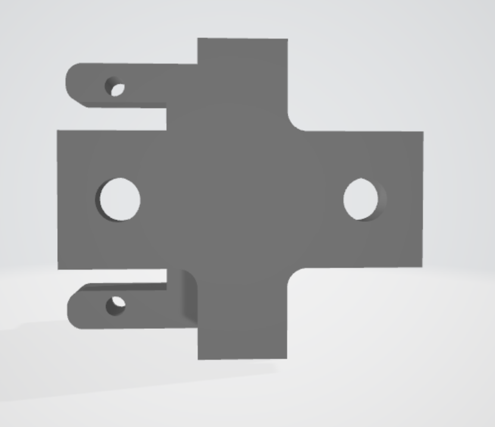 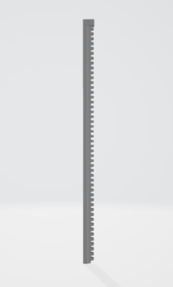 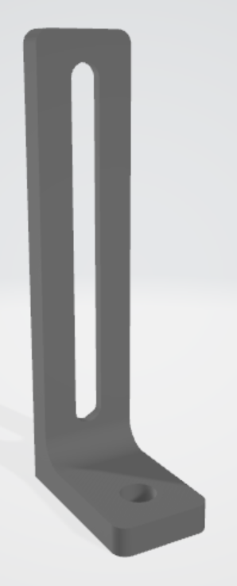 |
| Individual STL previews – `actuator_arm_base_motor_holder_single_hole`, `actuator_arm_base_rack_with_mount` | 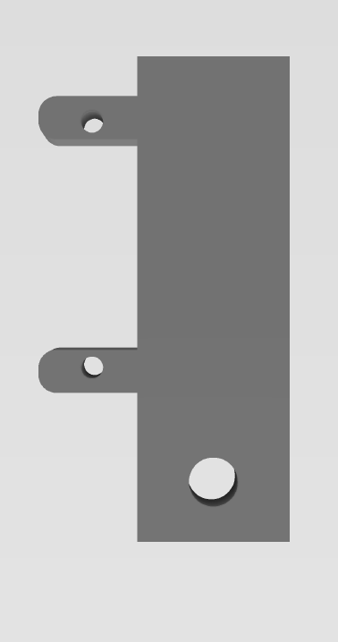 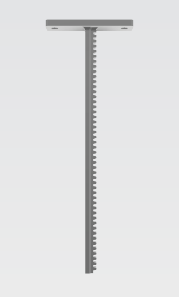 |
| SG90 with attached `pinion_gear` and motor holder parts | 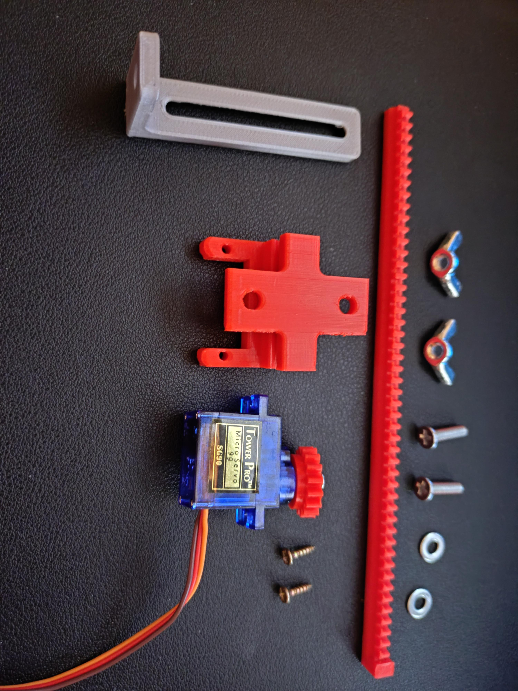 |
| Partially assembled: rack in place, then servo added | 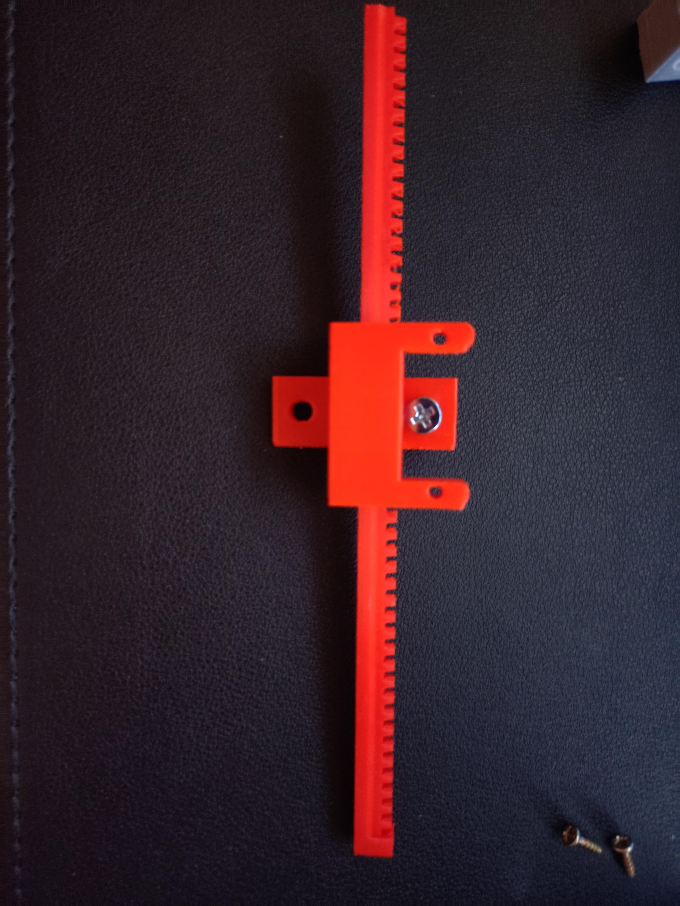 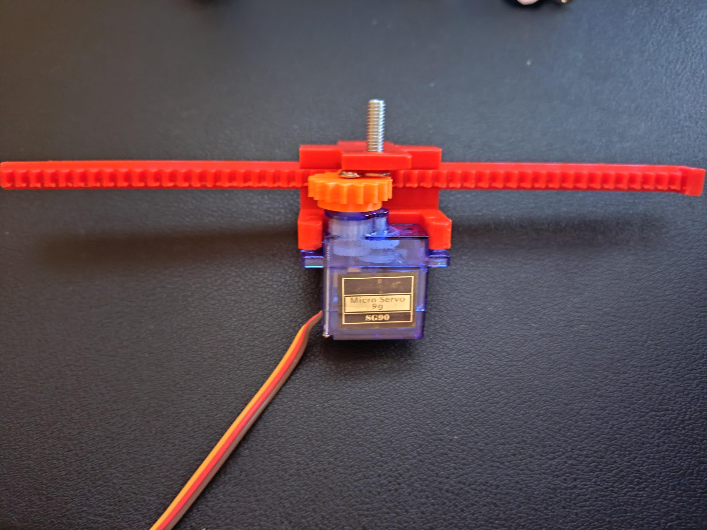 |
| Mounted on stand, ready to attach to base | 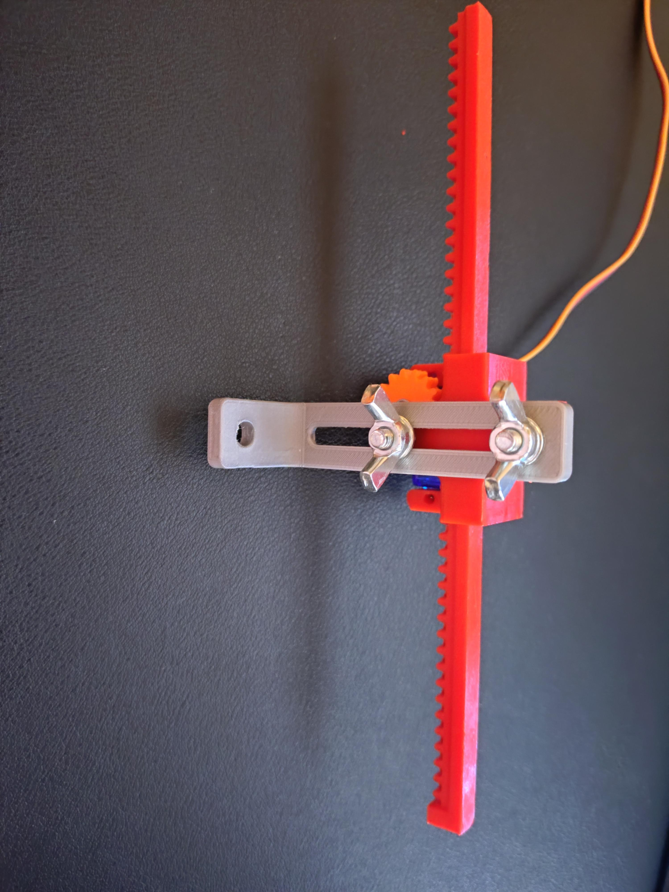 |

</details>

<details>
<summary><strong>Actuator Arm</strong></summary>

<br>

The actuator arm is the moving element that pushes buttons or touches a screen.  
It connects directly to the [`actuator_arm_base_rack.stl`](stl/actuator_arm_base/actuator_arm_base_rack.stl) and is driven by an SG90 servo with the [`pinion_gear.stl`](stl/pinion_gear/pinion_gear.stl) attached.

### Required Parts

- 1 × [`pinion_gear.stl`](stl/pinion_gear/pinion_gear.stl) — attached to the SG90 servo output shaft through the hub of a cut-down horn  
- 1 × SG90 micro servo (with 2 × mounting screws supplied with the servo)  
- 1 × [`actuator_arm_motor_holder_mount.stl`](stl/actuator_arm/actuator_arm_motor_holder_mount.stl) — bracket, bolted to the motor holder; the base rack slides into its square mount hole  
- 1 × [`actuator_arm_rack.stl`](stl/actuator_arm/actuator_arm_rack.stl) <em>or</em> [`actuator_arm_rack_wide.stl`](stl/actuator_arm/actuator_arm_rack_wide.stl) — for linear motion; different shapes, for easier access to different buttons  
- 1 × [`actuator_arm_motor_holder.stl`](stl/actuator_arm/actuator_arm_motor_holder.stl) — attaches to the rack and connects to the base  
- 2 × M4 × 16 mm machine screws (DIN 965)  
- 2 × M4 washers (DIN 125A)  
- 2 × M4 hex nuts (DIN 934) — to attach the motor holder to the mount  
- Optional: stylus tip for touchscreens, grounded through a Dupont wire

### Assembly Steps

1. <strong>Attach the bracket</strong> ([`actuator_arm_motor_holder_mount.stl`](stl/actuator_arm/actuator_arm_motor_holder_mount.stl)) to the motor holder using 2 × M4 machine screws with washers and hex nuts.
2. <strong>Insert the rack</strong> ([`actuator_arm_rack.stl`](stl/actuator_arm/actuator_arm_rack.stl) or [`actuator_arm_rack_wide.stl`](stl/actuator_arm/actuator_arm_rack_wide.stl)) into the motor holder.
3. <strong>Install the SG90 servo</strong>: attach the [`pinion_gear.stl`](stl/pinion_gear/pinion_gear.stl) to the servo output shaft through the hub of a cut-down horn, align with the rack teeth, and fasten the servo using the 2 screws supplied with the SG90.

### Visual Reference

| Description | Image |
|-------------|-------|
| Individual STL previews – `actuator_arm_motor_holder_mount`, `actuator_arm_motor_holder`, `actuator_arm_rack`, `actuator_arm_rack_wide` | 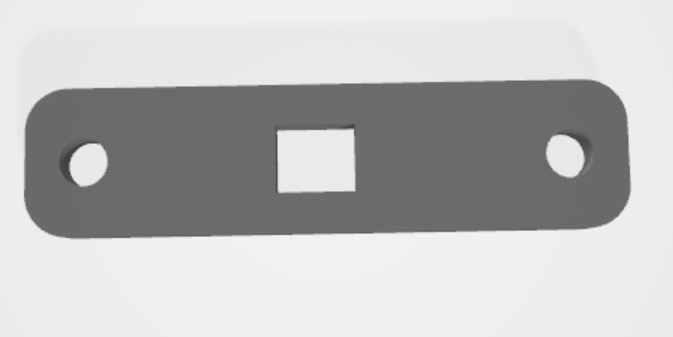 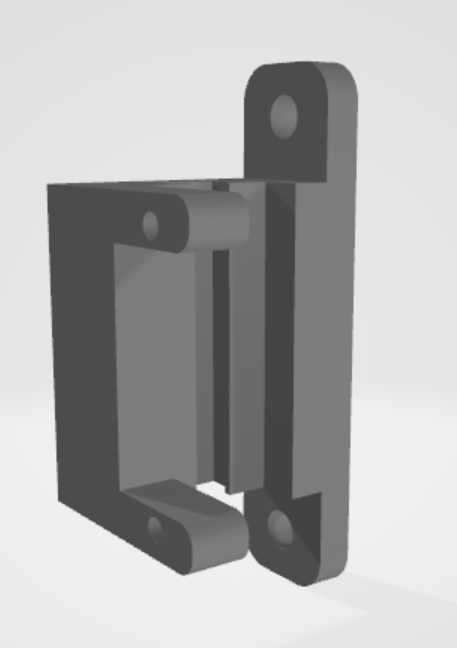 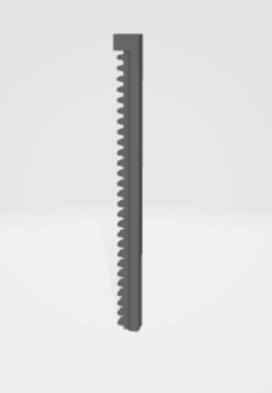  |
| Actuator arm assembly | 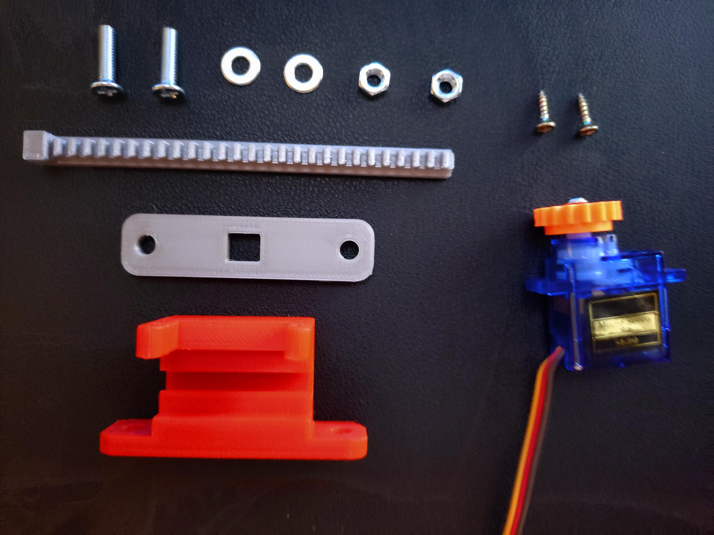 |
| Bracket bolted to the motor holder | 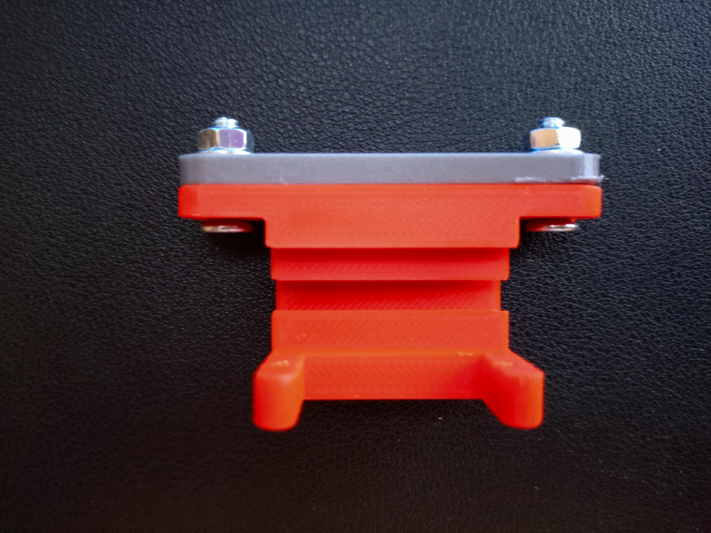 |
| Mounted actuator arm | 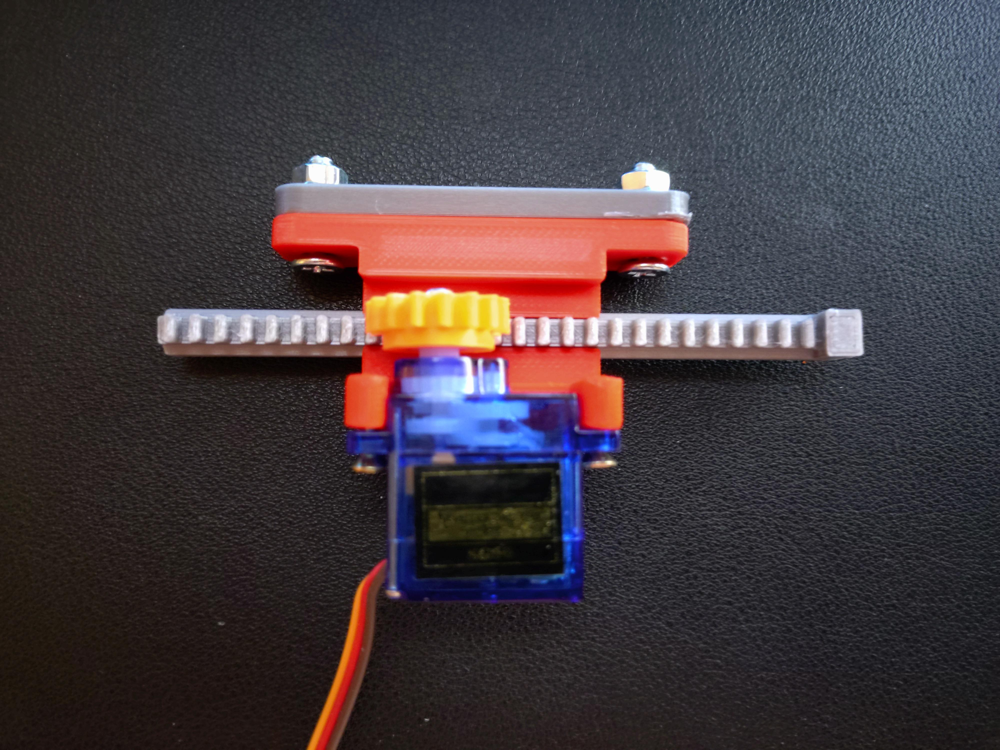 |


### Connecting the Actuator Arm to the Base

No screws are needed for this step – simply slide the [`actuator_arm_base_rack.stl`](stl/actuator_arm_base/actuator_arm_base_rack.stl) into the square mount hole in the middle of the [`actuator_arm_motor_holder_mount.stl`](stl/actuator_arm/actuator_arm_motor_holder_mount.stl) plate until it seats fully.

| Step | Image |
|------|-------|
| Align the base rack with the actuator arm mount hole | 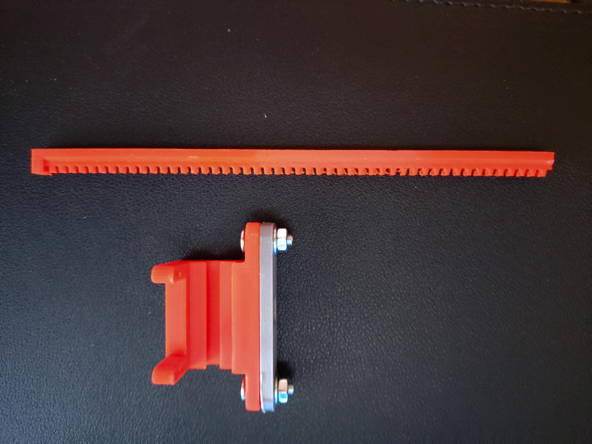 |
| Slide until seated fully | <div align="center">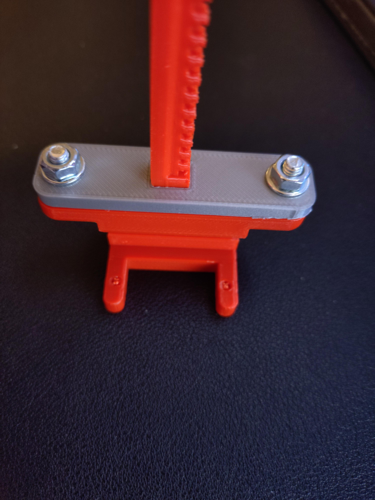</div> |


</details>

## Software / demos

The [`demos/`](demos/) directory holds the example code. The table repeats what each file says about itself in its header or docstring and lists its third-party includes and imports.

| File | Purpose | Third-party imports | Hardware | How to run |
|------|---------|---------------------|----------|------------|
| [`servos.ino`](demos/servos.ino) | Demo file for 2 servo arms to press buttons | `#include`: `Servo.h` | Arduino | Flash it to an Arduino |
| [`servos.py`](demos/servos.py) | Demo of Arduino servo pressing via USB serial | `serial` | Arduino on USB serial | From another script: `from servos import press_left, press_right, press_both`; optionally `set_port("/dev/ttyACM0")` to pin the port if autodetect guesses wrong |
| [`pca_servos.py`](demos/pca_servos.py) | PCA9685 servo pressing via I2C | `board`, `busio`, `adafruit_pca9685` | Raspberry Pi, PCA9685 | From another script: `from pca_servos import press_left, press_right, press_both`; the docstring also lists optional tuning calls |
| [`ocr_demo.py`](demos/ocr_demo.py) | Demo file for OCR and possible preprocessing | `pytesseract`, `PIL`, `cv2`, `numpy`, `matplotlib` | Raspberry Pi | Run it on a Raspberry Pi |
| [`cars/`](demos/cars/) | The cars demo: PRESSTO plays a two-cars phone game (a camera watches the phone, two servo arms tap it) | `cv2`, `numpy`, `board`, `busio`, `adafruit_pca9685`, `gpiozero`, `picamera2`, `libcamera` | Raspberry Pi with a display, a camera and a PCA9685; a phone running the game | Camera check, `calibrate.py`, then `cars_pca.py`: see [`demos/cars/README.md`](demos/cars/README.md) |

Both Python servo files end with a small command-line test: `python3 demos/servos.py --left` (also `--right`, `--both`, and `--port /dev/ttyACM0` to pick the serial port) and `python3 demos/pca_servos.py --both` (also `--left`, `--right`).

`ocr_demo.py` is a short demo: run it on the Raspberry Pi with `python3 demos/ocr_demo.py`. It needs a display, because it shows the processed image (`plt.show()`) before it prints the detected text, and it calls `rpicam-still` to capture the image.

The docstring of `pca_servos.py` carries two notes, quoted here verbatim:

> - Requires external 5V on PCA V+ for servos.
> - Pi GND must be common with PCA GND.

Future versions are planned to replace the Arduino with a servo driver board on the Raspberry Pi's I²C bus; `demos/pca_servos.py` already drives the servos that way (PCA9685).

### Serial protocol of `servos.ino`

The sketch opens the serial port at `115200` baud and prints `READY` once it has started. It then reads one command per line: a command ends with a newline, and the input is trimmed and converted to upper case before it is compared.

| Command | Action | Reply |
|---------|--------|-------|
| `P0` | press left (index 0) | `OK P0` |
| `P1` | press right (index 1) | `OK P1` |
| `PA` | press both simultaneously | `OK PA` |

Any other non-empty line is answered with `ERR (use P0, P1, or PA)`.

Servo signal pins: `9` (left) and `10` (right).

The servos need their own 5 V supply — a lab supply or a standard smartphone charger (through a USB breakout board) both do the job; do not power them from the Arduino's 5 V pin. Connect the supply's ground to the Arduino's GND.

`servos.py` is the Python side of this protocol; its docstring notes that `press_both()` needs a sketch that supports `PA`.

### Installing the dependencies

The Python packages that the demos import are listed, by their PyPI project names, in [`demos/requirements.txt`](demos/requirements.txt); the comments in that file say which demo imports what. From the root of the repository:

```
python3 -m pip install -r demos/requirements.txt
```

The cars demo lists its packages in `demos/cars/requirements.txt` and its install notes in `demos/cars/README.md`.

From Raspberry Pi OS Bookworm onwards, pip installs only into a Python virtual environment: create one with `python3 -m venv env`, enter it with `source env/bin/activate`, then run the pip line.

`pytesseract` is a wrapper for Google's Tesseract OCR engine. The engine is a separate program that pip does not install: install it on its own, so that the `tesseract` command can be invoked.

`servos.ino` includes the Arduino `Servo` library. The sketch says where to get it:

> in Arduino IDE: Tools -> Manage Libraries... -> search "Servo" -> install

## License

The MIT licence in [`LICENSE`](LICENSE) covers every file in this repository, including the CAD (`.ipt`) and STL files.
