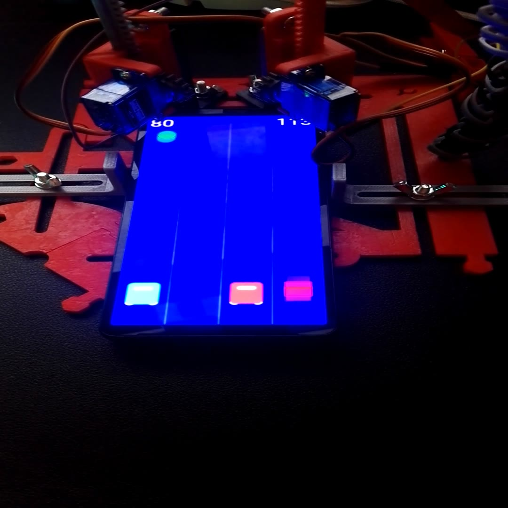

# Cars demo: PRESSTO plays a phone game

<a href="https://github.com/crocs-muni/pressto/releases/tag/v1.0"></a>

*The picture links to the [PRESSTO `v1.0` release](https://github.com/crocs-muni/pressto/releases/tag/v1.0), which has the video of the demo attached.*

PRESSTO plays a two-cars phone game: a camera watches the phone's screen and two servo arms tap it. The game shows two cars in four lanes (0 to 3, from the left), with green circles to collect and red squares to avoid. A tap on the left half of the screen switches the left car between lanes 0 and 1, a tap on the right half switches the right car between lanes 2 and 3; the left arm taps the left half, the right arm the right half. The bot taps to move a car away from an object to avoid in its lane, or towards an object to collect in its other lane.

The game is an Android app written for this demo, in its own repository: [pressto-cars-game](https://github.com/crocs-muni/pressto-cars-game).

Three programs run on the Raspberry Pi, in this order:

| Program | What it does |
|---------|--------------|
| [`test_camera.py`](test_camera.py) | camera check: finds the camera, reads frames, saves the last one; opens no window |
| [`calibrate.py`](calibrate.py) | calibration: marks the game area and samples the colours; writes `calibration.json` |
| [`cars_pca.py`](cars_pca.py) | the bot: reads `calibration.json`, watches the game and taps |

## What you need

- A Raspberry Pi running Raspberry Pi OS with its desktop, **a display, a keyboard and a mouse**. `calibrate.py` and `cars_pca.py` show OpenCV windows and read the keyboard (and, in `calibrate.py`, the mouse) through them; there is no headless mode yet.
- A camera that sees the whole phone screen: a Raspberry Pi camera through Picamera2, or a USB camera through OpenCV (device 0). The programs try Picamera2 first and fall back to OpenCV.
- A PCA9685 servo board on the Raspberry Pi's I²C bus: SDA to GPIO 2 (physical pin 3), SCL to GPIO 3 (physical pin 5), VCC (the board's logic supply, 3 to 5 V) to the Raspberry Pi's 3.3 V, GND to GND. The driver uses the board's default address, 0x40. The left arm's servo goes on channel 12, the right arm's servo on channel 15. (The other PCA9685 demo, [`demos/pca_servos.py`](../pca_servos.py), defaults to the opposite: left 15, right 12.) The two power notes in the docstring of `pca_servos.py` apply here too:
  > - Requires external 5V on PCA V+ for servos.
  > - Pi GND must be common with PCA GND.
- PRESSTO's printed parts, built as the [main README](../../README.md#assembly-instructions) describes: the base with the holders that clamp the phone, a camera arm, and two actuator arms over the phone, the left one over the left half of its screen, the right one over the right half. `cars_pca.py` drives one servo per arm, the one that presses (channels 12 and 15); nothing moves the arms' other servos. At the booth, the phone was touched by stylus tips grounded with Dupont wires.
- Optional: an LED on BCM17 (through a series resistor, its other leg to GND) and a push button on BCM27 (its other leg to GND; the program uses the internal pull-up). The bot runs without them.
- A phone running the game, in portrait orientation (at the booth it was not sideways): `calibrate.py` rectifies the screen to a portrait image of 360 × 640 pixels.

The booth's Raspberry Pi model, camera and phone, how its arms were mounted, and the package versions that ran there were not recorded.

## Install

1. Get this repository onto the Raspberry Pi, for example with `git clone https://github.com/crocs-muni/pressto.git`.
2. Enable I²C: run `sudo raspi-config`, open "Interface Options", select "I2C" and answer `Yes` (the current Raspberry Pi documentation gives the path `3 Interface Options > I5 I2C`). To check the wiring, install `i2c-tools` (`sudo apt install -y i2c-tools`): `i2cdetect -y 1` should list the PCA9685 at `40`.
3. Picamera2 (which brings the `libcamera` Python module) and GPIO Zero come with Raspberry Pi OS. If your image lacks them:
   ```
   sudo apt install -y python3-picamera2 python3-gpiozero
   ```
4. Since Raspberry Pi OS Bookworm, pip installs only into a virtual environment. Create one for this demo with `--system-site-packages`, so that it sees Picamera2 and GPIO Zero, and install the packages of [`requirements.txt`](requirements.txt): OpenCV, NumPy, the Adafruit PCA9685 driver and Adafruit Blinka (which provides `board` and `busio`). From the root of the repository:
   ```
   python3 -m venv --system-site-packages cars-env
   source cars-env/bin/activate
   python3 -m pip install -r demos/cars/requirements.txt
   ```
   Make a new environment even if you already have one for the other demos: an environment made without `--system-site-packages` does not see Picamera2 or GPIO Zero. `requirements.txt` names `opencv-python`, not a `-headless` OpenCV package, because `calibrate.py` and `cars_pca.py` open windows.

## Run

Run the programs in a terminal on the Raspberry Pi's desktop, from this folder: `calibrate.py` writes `calibration.json` into the current folder and `cars_pca.py` reads it from there. In every new terminal, first enter the environment, from the root of the repository:

```
source cars-env/bin/activate
cd demos/cars
```

OpenCV reads keys only while one of its windows has the focus. In `calibrate.py` a click inside the window also acts (it adds a corner or takes a sample), so give that window the focus by clicking its title bar.

### 1. Camera check: `test_camera.py`

```
python3 test_camera.py
```

It prints the Python and OpenCV versions, the `/dev/video*` devices and, if `v4l2-ctl` is installed, its device list (otherwise a line on how to install it, for information only), starts the camera, reads 30 frames and saves the last one as `cam_debug_frame.jpg`. The line `[cam] Picamera2 320x180 @…fps` or `[cam] OpenCV 320x180 @…fps` says how the camera was opened: through Picamera2 (a Raspberry Pi camera) or through OpenCV; the other `[cam]` lines report autofocus, OpenCV's settings, or why Picamera2 was not used. Open the picture to check that the camera sees the whole phone screen; with a Raspberry Pi camera its red and blue are swapped, which is expected (see step 2 of the calibration).

`calibrate.py` and `cars_pca.py` open a USB camera only as OpenCV device 0, through OpenCV's default backend (this check asks for V4L2), without the MJPG request and without this check's silent read retries: a camera that works here only with `--index`, `--mjpg` or `--force-opencv`, or only after failed reads, may not work in them (they always try Picamera2 first).

The options (`python3 test_camera.py --help` lists them too):

| Option | Default | What it does |
|--------|---------|--------------|
| `--width N` | `320` | frame width |
| `--height N` | `180` | frame height |
| `--index N` | `0` | OpenCV device index (only used for the OpenCV backend) |
| `--frames N` | `30` | how many frames to read |
| `--save FILE` | `cam_debug_frame.jpg` | where to save the last frame |
| `--probe` | off | only try the OpenCV device indices 0 to 9 and report each, then stop |
| `--mjpg` | off | ask an OpenCV camera for MJPG (USB webcams often like this) |
| `--force-opencv` | off | use OpenCV, skip Picamera2 |
| `--force-picam2` | off | use Picamera2 only (see [Known issues](#known-issues)) |

### 2. Calibration: `calibrate.py`

```
python3 calibrate.py
```

The calibration is part of the initial setup, done by hand: it tells the bot where the phone's screen lies in the camera image and what the game's colours look like to your camera under your lighting. The window shows the live camera image on the left. Once the game area is marked, the right panel shows it rectified, squeezed to the size of the camera image, with the four lanes and the decision line: the bot acts on objects that come close to that line.

1. On the phone, open the game's calibration screen: hold a finger on its start screen ("tap to start") for 5 seconds. It shows one object to collect (a green circle) and one to avoid (a red square) on the blue background.
2. Keep the default resolution, 320 × 180: `cars_pca.py` always captures at 320 × 180, and `calibration.json` does not record the resolution. The game must appear upright in the left panel, as a player sees it (its text readable). If the image is mirrored or turned, or its red and blue are swapped (with a Raspberry Pi camera they always are), fix it now with `H`, `V`, `T` or `X`, before step 3: these settings are saved with the calibration and shape the still copy that `Space` takes. Do not change them after `Space`: if you do, press `Space` and mark the corners again, and after `X` also take the three colour samples again.
3. Press `Space`: the program keeps a still copy of the image (the left panel stays live). Click the four corners of the phone's screen in the left panel, in any order, and press `Enter` (the window asks for top-left, top-right, bottom-right, bottom-left, but the program sorts the corners by their position, so the orientation comes only from step 2). The game fills the whole screen, draws its four lanes over the full width and its cars at 88 % of the height, which is where `cars_pca.py` expects them. The right panel now shows the rectified still copy: the circle should sit in the middle of the second lane, the square in the middle of the third. If not, correct the orientation (step 2), then press `Space` and mark the corners again.
4. Press `G` and click the green circle, `B` and click the red square, `E` and click the background, all in the right panel.
5. Press `Y` and click where the decision line should be, or move it with `[` and `]`; it starts at 80 % of the height.
6. Press `S`: the terminal shows `[save] Wrote …/calibration.json`. `S` saves the corners accepted with the last `Enter` together with the three colours; until both exist, it does nothing and prints nothing.
7. Quit with `Q` before you start `cars_pca.py`: a Raspberry Pi camera can be used by only one program at a time. Calibrate again whenever the camera, the phone or the holders move, or the lighting changes.

#### Keys of `calibrate.py`

Letters work in either case.

| Key | Action |
|-----|--------|
| `Q`, `Esc` | quit |
| `Space` | keep a still copy of the camera image to mark the corners on (the left panel stays live; starts the marking over) |
| click (left mouse button) | while marking: add a corner, up to four, wherever you click; in the right panel after `G`, `B`, `E` or `Y`: take that colour sample or set the decision line — the mode stays, so every further click there replaces it |
| `U` | remove the last corner (while marking) |
| `Enter` | accept the four corners and show the rectified still copy |
| `G`, `B`, `E` | sample mode: the colour to collect, to avoid, or of the empty background (clicks in the right panel) |
| `Y` | decision-line mode (clicks in the right panel) |
| `[`, `]` | move the decision line up, down by 1 % of the height (between 50 % and 95 %) |
| `R` | clear the colour samples and leave the sample mode (keeps the corners) |
| `S` | save `calibration.json`: the corners accepted with the last `Enter` and the three colours (until both exist, nothing happens) |
| `H`, `V` | flip the image horizontally, vertically (the on-screen hint calls H, V and T "rotate") |
| `T` | rotate the image by 90 degrees |
| `X` | swap red and blue |
| `1`, `2`, `3` | camera resolution 320 × 180, 480 × 270, 640 × 360; calibrate at 320 × 180 (step 2, and see [Known issues](#known-issues)) |
| `F` | refocus a USB camera with autofocus (no effect with Picamera2, which keeps autofocusing on its own) |

### 3. Play: `cars_pca.py`

```
python3 cars_pca.py
```

The window shows the rectified game: the lane numbers, the decision line, a thin line where the scanned area ends and the car line (where the cars are expected; with the default settings the two nearly coincide), with, above them, the edge of the band that detection ignores; the nearest object per lane (`G` to collect, `R` to avoid), green or red ticks where an object crosses the decision line, where the bot believes the cars are (`L@n`, `R@n`), its plan for each side and a status line (most of which is cut off, see [Known issues](#known-issues)).

The bot starts in HUMAN mode: it does not tap on its own. Check the arms first, the first time with the styluses clear of the phone:

- The first tap, whether from a test key or from the bot, also sends the other servo to its rest angle; the tapping one goes straight to its press angle. The angles: rest 70° and press 160° for the left servo (channel 12), rest 150° and press 90° for the right one (channel 15), each tap held for 0.10 s. These are the booth's values; set yours in `LEFT_REST_DEG`, `LEFT_PRESS_DEG`, `RIGHT_REST_DEG` and `RIGHT_PRESS_DEG` near the top of `cars_pca.py`.
- `1` and `2` tap the left and the right side. If the wrong arm moves, swap the two servo plugs on the PCA9685: each channel keeps its own angles, and `S` only exchanges the sides.

Then leave the game's calibration screen (double-tap it) and let the bot play:

- With the game's start screen ("tap to start") or game-over screen ("tap to play again") showing, press `B` (or the button): after 5 seconds the bot taps the right side once, which starts a game, assumes both cars are in the middle lanes (1 and 2), waits 1.5 s and plays (BOT mode). In BOT mode, `B` returns to HUMAN mode; during the countdown it only restarts the countdown (to stop the arming, quit with `Q`). Do not start the game by hand: the bot's tap is what starts it, and on a running game that tap would move the right car while the bot assumes it is still in a middle lane.
- While it plays, it taps when an object to avoid comes close to the decision line in a car's lane, or an object to collect comes close in that car's other lane, unless that other lane is blocked by an object to avoid; each side waits at least 0.22 s between taps.
- If nothing crosses the decision line for 7 seconds, it takes the game as over: it taps the right side once more ("tap to play again") and starts again from the middle lanes.
- The LED is off in HUMAN mode, blinks while arming and is on in BOT mode.

#### Keys of `cars_pca.py`

Letters work in either case, except `r`.

| Key | Action |
|-----|--------|
| `Q`, `Esc` | quit (if a tap has opened the PCA9685, both servos return to rest) |
| `B` | arm the bot (HUMAN → 5 s → BOT), or back to HUMAN; pressed while arming, it restarts the 5 s |
| `1`, `2` | test tap: left side, right side (in every mode; in BOT mode the bot does not notice that the car moved, so test in HUMAN mode) |
| `S` | swap the sides (left ↔ right); each channel keeps its angles |
| `r` | lower case only: reset where the bot believes the cars are (both in the middle lanes) |
| `L` | reload `calibration.json` (this also resets the decision line to its saved value) |
| `[`, `]` | move the decision line up, down by 1 % of the height |
| `-`, `=` | scan less, more of the image below the decision line (0 % to 30 %) |
| `,`, `.` | make the ignored band above the cars smaller, larger (1 % to 12 % of the height; it never reaches higher than 2 % below the decision line) |
| `I` | ignore the band above the cars in detection: on / off |
| `O` | shade the ignored band in the picture: on / off |
| `D` | overlay (lanes, markers, plan): on / off |
| `C` | show only the detected colours: on / off |
| `F` | refocus a USB camera with autofocus (no effect with Picamera2) |

At start the ignored band is on, its shading off, the overlay on, the colours-only view off and the sides not swapped. Nothing changed with these keys is saved.

## Files the programs write

| File | Written by | Read by |
|------|------------|---------|
| `calibration.json` | `calibrate.py` (`S`), in the current folder | `cars_pca.py`, from the current folder, at start and on `L` |
| `cam_debug_frame.jpg` | `test_camera.py` (the default of `--save`), in the current folder | you |

`cars_pca.py` writes no file; it prints what it does in the terminal.

## Good to know

- `Q`, `Esc`, Ctrl+C in the terminal, `kill` (SIGTERM) and closing the terminal (SIGHUP, also under `nohup`) all end `cars_pca.py` through its clean-up, which first returns both servos to rest (once a tap has opened the PCA9685). A tap interrupted during its 0.10 s hold releases its servo at once.
- A servo can still stay pressed if one of these happens during a tap: `kill -9` (SIGKILL), Ctrl+\ (SIGQUIT), a crash of the Python process (also inside OpenCV or the camera library), or the Raspberry Pi losing power while the servo board keeps its own supply. No clean-up runs then, and the PCA9685 keeps sending the last pulse until the next tap of a later run or until the board loses power. The same can happen if the servo board stops answering on I²C during a release (a loose wire, a supply dip: the release fails and the program ends with that error), or if a second interrupt arrives before the clean-up has finished. Ctrl+Z pauses the program without any clean-up, with a servo caught mid-tap still pressed.
- In BOT mode the right arm taps every 7 seconds for as long as nothing crosses the decision line, whether a game is on the screen or not: press `B` to stop it.
- Taps need the PCA9685 driver and the board: without them `cars_pca.py` starts, but its first tap ends it with an error. The message "PCA9685 library not available. Install with: pip3 install adafruit-circuitpython-pca9685" appears when `adafruit_pca9685`, `board` or `busio` cannot be imported; install `requirements.txt` into the environment you run the program in (step 4 of Install) instead of running that line.
- With GPIO Zero installed (as on Raspberry Pi OS), `cars_pca.py` uses BCM17 as an output and BCM27 as an input whether or not an LED and a button are wired.
- "calibration.json not found. Run the setup tool first." means: run `calibrate.py` first, in this folder.

## Known issues

- In `calibrate.py` and `cars_pca.py`, arrow and page keys can act as letters: OpenCV keeps only the low 8 bits of a key code, and the Left arrow's code 0xFF51 then reads as `Q`. So Left quits, Right acts as `S` (swaps the sides in `cars_pca.py`, saves in `calibrate.py`), Up as `R` (clears the samples in `calibrate.py`), Down as `T` (rotates the image in `calibrate.py`), Page Up as `U` (removes a corner) and Page Down as `V` (flips the image). Avoid them.
- On-screen text is wider than the image and is cut off at its right edge. `cars_pca.py`'s status line shows little more than the resolution, the frame rate and the mode; the side mapping, the scan limit and the arming countdown are drawn past the edge, and the plan lines lose their ends. At 320 × 180, `calibrate.py`'s help lines are cut after about 30 characters. (Where it does show, `≤`, `≥` or `°` appears as `???` or `??`: the font the programs use draws only ASCII characters.)
- `calibrate.py` with Picamera2: the resolution keys `1`, `2` and `3` end the program with an error, because the camera is opened again while it is still held.
- `test_camera.py --force-picam2`: when Picamera2 cannot start, the program prints `[cam] OpenCV 320x180 @unknownfps` and then stops with an `AttributeError` instead of its message "Forced Picamera2 but it failed to start."
